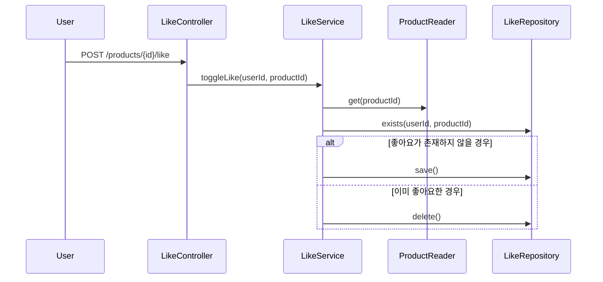
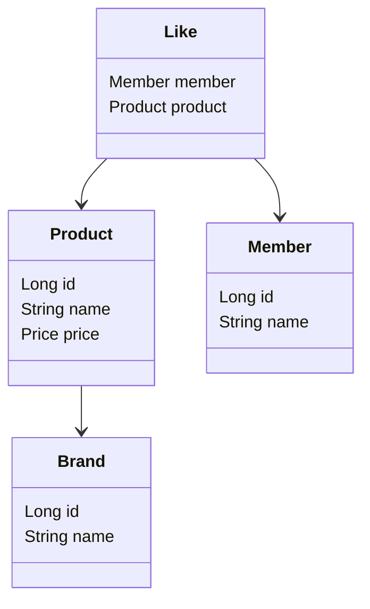
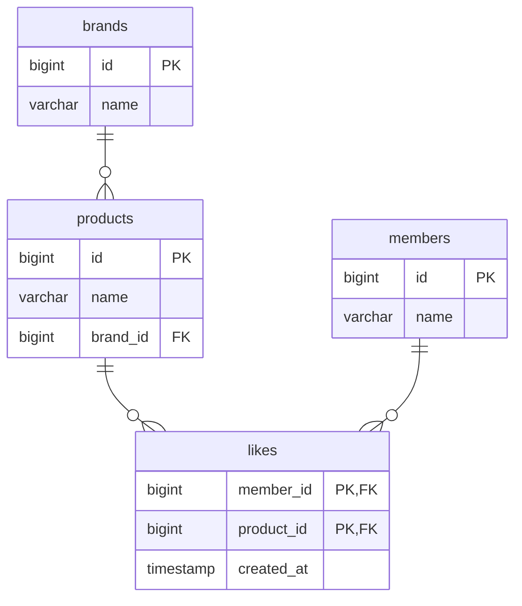

# 🧭 루프팩 BE L2 - Round 2

> 요구사항을 설계로 옮기는 힘, 도메인을 해석하는 힘을 기른다.
>

<aside>
🎯

**Summary**

</aside>

- 기능 요구사항을 **도메인 모델**, **시스템 설계**로 전환하는 흐름을 체험한다.
- 시퀀스 다이어그램, 클래스 다이어그램, ERD 등을 활용해 **협력 구조와 데이터 구조**를 시각화한다.
- 상품/주문/브랜드/좋아요 등 도메인을 중심으로 실습해본다.
- 설계한 결과물을 기반으로 개발 준비를 마친다.

<aside>
📌

**Keywords**

</aside>

- 요구사항 정리 / 기능 명세
- 시퀀스 다이어그램
- 클래스 다이어그램
- ERD (Entity Relationship Diagram)
- 도메인 모델 / 엔티티 / VO
- 설계 문서화

<aside>
🧠

**Learning**

</aside>

## 📋 요구사항 정리

> **사용자 니즈**를 **기능 명세로 전환**하는 분석 과정이예요.
>

### 💡 실무에서 왜 중요할까?

- 구현 후 **“이건 제가 원한 기능이 아니에요”** 라는 말을 듣지 말자
- 기획/디자인/개발 간 **커뮤니케이션의 언어적 기준점**
- 요구사항을 **객체, 테이블, API 설계로 연결**하기 위한 출발점

### 🛠 어떻게 접근할까?

1. 유저 시나리오 도출 → 자연어 설명
2. 행위 중심 기능 목록 정리 (예: 사용자 관점에서의 기대 동작)
3. **유스케이스 흐름** 작성 (Main / Alternate / Exception Flow)
4. 각 흐름에 예외, 조건 분기, 후속 동작 포함

### 💬 예시

```markdown
[유저 스토리]
- 사용자는 상품을 찜할 수 있다.
- 이미 찜한 상품을 다시 누르면 찜이 취소된다.

[기능 흐름]
1. 로그인 사용자만 가능
2. 좋아요 누르면 존재 여부 판단
3. 없으면 저장, 있으면 삭제
4. 좋아요 수 반영
```

### ⚠ 자주 겪는 실수

- 기능 중심만 있고 예외/조건이 없음 (ex. 로그인 여부 고려 안함)
- 유스케이스 흐름을 너무 **추상적**으로 작성
- 실제 흐름과 명세가 점차 이격이 발생

---

## 📋 유비쿼터스 언어

> 모든 협업자가 **동일한 언어로 도메인을 이해하고 소통**하기 위한 전략적 용어 체계를 말해요.
>

### 💡 실무에서 왜 중요할까?

- 용어 불일치로 인한 설계 오류를 줄임 (예: '상품' vs '아이템' 혼용)
- 기획자, 디자이너, 개발자, QA가 같은 단어로 같은 개념을 이해
- 코드와 문서 간 용어 정합성 유지 (코드 = 모델, 문서 = 명세)

### 🛠 어떻게 접근할까?

1. 도메인 용어를 정리하고 문서로 공유
2. 기능/요구사항 문서, ERD, API 명세서, 클래스 명에 동일한 단어 사용
3. 새로운 용어 도입 전엔 반드시 정의와 맥락 공유

### 💬 예시

```
상품 → Product
브랜드 → Brand
좋아요 → Like
주문 → Order
```

### ⚠ 자주 겪는 실수

- 도메인마다 표현이 다른 것과 같이 통일 없이 사용
- 코드에서는 영문/축약어, 기획서에서는 한글/다른 단어
- enum, 상태 값 등에서 의미 없는 용어 사용 (ex. 상태1, 상태2)

---

## 📋 시퀀스 다이어그램

> **객체 간 메시지 흐름을 시각화**하여 책임과 협력을 표현하는 도구예요.
>

### 💡 실무에서 왜 중요할까?

- "누가 무엇을 책임지는가"를 명확히 파악 가능
- 코드보다 빠르게 흐름 구조를 공유할 수 있음
- 팀 내 협업(특히 프론트 ↔ 백엔드 ↔ 기획 간)에서 설계 커뮤니케이션 기반이 됨

### 🛠 어떻게 접근할까?

1. 기능 하나당 하나의 시퀀스를 만듦
    1. **e.g.** 사용자 → Controller → Application → Domain → Infra
2. 흐름의 순서, 조건 분기, 이벤트 발행 등을 표현
3. 도구를 활용해 이를 시각화

### 💬 Mermaid 예제



### ⚠ 자주 겪는 실수

- 너무 많은 세부 흐름을 다 넣어서 시퀀스가 복잡함
- 도메인 객체 간 메시지 없이 Service만 호출
- 시퀀스와 실제 구현이 따로 놀아 유지보수 불가능

---

## 📋 클래스 다이어그램 & 도메인 모델

> **시스템 구성 객체** 간 구조와 책임을 시각화한 설계 도구예요.
>

### 💡 실무에서 왜 중요할까?

- 도메인 개념 간 책임과 관계를 시각화함
- 설계 → 코드 전환 시 자연스럽게 연결됨
- 패키지 구조, 의존성 구조 설계에 기준이 됨

### 🛠 어떻게 접근할까?

1. 엔티티/VO 분리 기준: ID 존재 여부, 생명 주기
2. 연관 관계: 단방향 기본, 양방향 최소화
3. 비즈니스 책임은 도메인 객체에 포함시키기
4. 설계 후, "한 객체에 책임이 몰리지 않았는가?" 점검

### 💬 Mermaid 예제



### ⚠ 자주 겪는 실수

- 모든 필드를 객체로 표현하려다 지나친 복잡도
- 도메인 책임 없이 Service에 모든 로직 집중
- VO를 테이블처럼 다루려는 시도 (ex. Price를 별도 DB로 설계)

---

## 📋 ERD 설계

> **데이터 간 관계**를 정의하여 테이블 구조와 제약을 표현하는 모델이예요.
>

### 💡 실무에서 왜 중요할까?

- 도메인 모델의 물리적 구현 기반
- 성능 이슈(조회 쿼리, 인덱스 등)와 직결
- API, 도메인, DB 간 구조 일관성 유지에 핵심 역할

### 🛠 어떻게 접근할까?

1. 1:N → 외래키, N:M → 조인 테이블로 설계
2. enum → VARCHAR 또는 코드 테이블
3. soft delete → `deleted_at` or `is_deleted` 플래그 방식
4. 상태 관리: `status` 컬럼 활용하여 명확한 상태 전이 표현

### 💬 Mermaid 예제



### ⚠ 자주 겪는 실수

- 비즈니스 흐름이 반영되지 않은 정규화만 추구
- 중복 데이터 제거만 집중해 조회 JOIN이 과도해짐
- 상태 컬럼 없음 → 코드에서 하드코딩으로 해결함

<aside>
📚

**References**

</aside>

| 구분 | 링크 |
| --- | --- |
| 📚 도메인 주도 설계 | https://www.msaschool.io/operation/design/design-two/ |
| 🎬 시퀀스 다이어그램 | https://www.ibm.com/docs/ko/rsas/7.5.0?topic=uml-sequence-diagrams |
| 🗃 ERD | https://www.lucidchart.com/pages/er-diagrams |
| 🧩 머메이드 | https://mermaid.js.org/ |

> 원활한 실습 진행을 위해 다음 도구를 권장합니다.
* `mermaid` : https://mermaid.live
* `excalidraw` : https://excalidraw.com/
* `lucid chart` : https://www.lucidchart.com/
>

<aside>
🌟

**Next Week Preview**

</aside>

> 다음 주에는 본격적으로 각 필요 객체들을 구현하고, 단위 테스트를 통해 안정적으로 기능을 작성합니다.
>