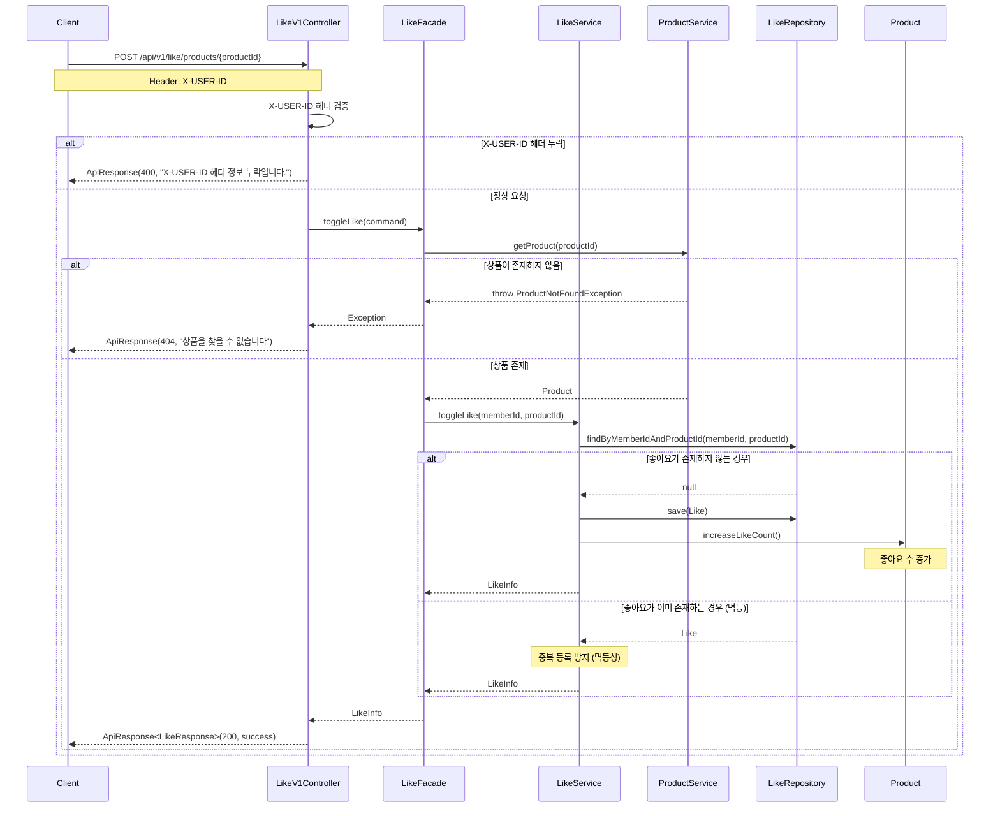
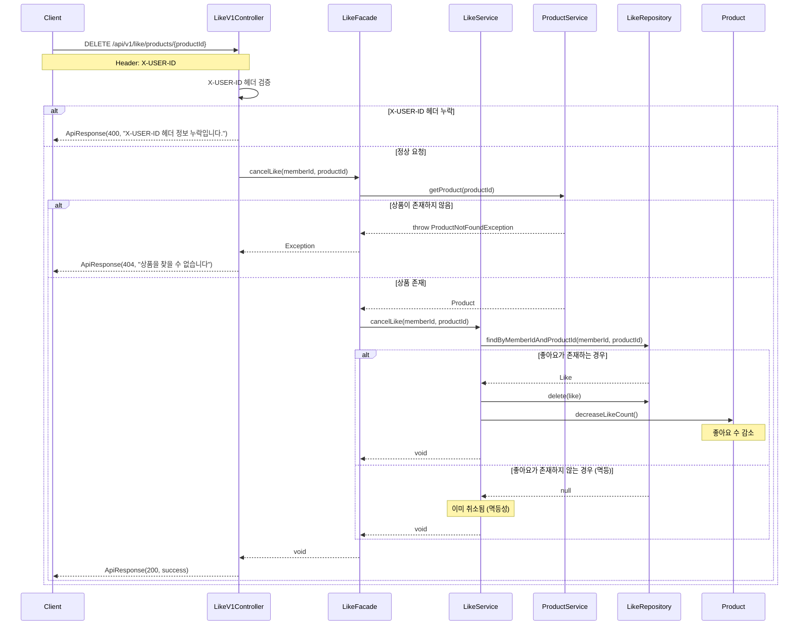
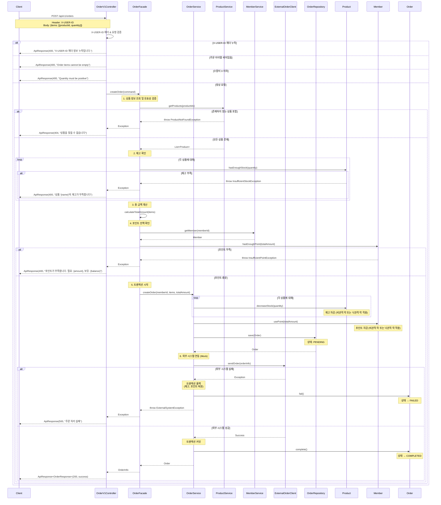
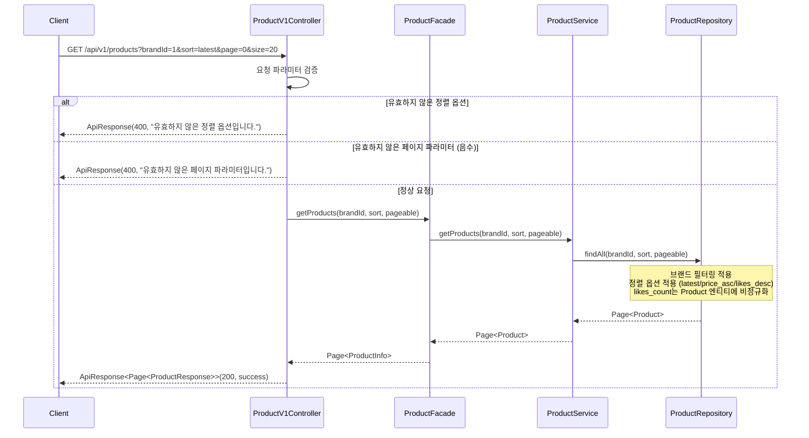
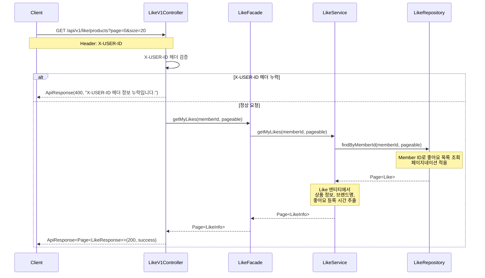
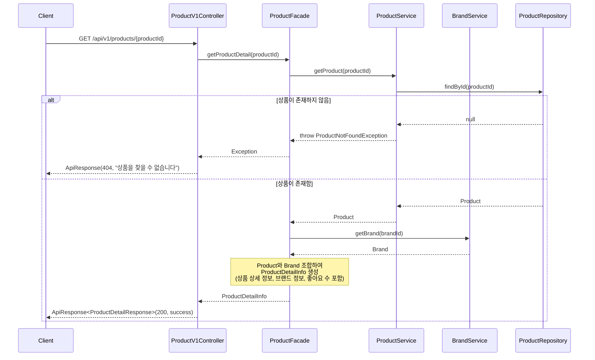

# 02. 시퀀스 다이어그램

## 1. 상품 좋아요 등록 (멱등 동작)

### 시나리오
사용자가 상품에 좋아요를 등록하는 흐름입니다.
멱등성을 보장하여 같은 요청이 여러 번 와도 동일한 결과를 반환합니다.



---

## 2. 상품 좋아요 취소 (멱등 동작)



---

## 3. 주문 생성 및 결제 흐름

### 시나리오
사용자가 여러 상품을 주문하고, 재고 차감 → 포인트 차감 → 외부 시스템 연동을 거쳐 주문이 완료되는 전체 흐름입니다.



---

## 4. 상품 목록 조회 (필터링 및 정렬)

### 시나리오
사용자가 브랜드 필터링과 정렬 옵션을 적용하여 상품 목록을 조회합니다.



---

## 5. 내가 좋아요한 상품 목록 조회

### 시나리오
사용자가 자신이 좋아요한 상품 목록을 조회합니다.



---

## 6. 상품 상세 조회

### 시나리오
사용자가 특정 상품의 상세 정보를 조회합니다. 브랜드 정보와 좋아요 수가 포함됩니다.



---

## 핵심 설계 포인트

### 1. 계층 구조 (실제 프로젝트 구조 반영)

```
interfaces/api (Controller)
    ↓
application (Facade)
    ↓
domain (Service, Entity, Repository)
    ↓
infrastructure (RepositoryImpl)
```

**각 계층의 책임:**
- **Controller (interfaces/api)**: HTTP 요청/응답 처리, DTO 변환, ApiResponse 생성
- **Facade (application)**: 여러 도메인 서비스 조율, 트랜잭션 경계, Command/Info 객체 변환
- **Service (domain)**: 도메인 로직 수행, 비즈니스 규칙 검증
- **Entity (domain)**: 비즈니스 규칙 (Product.decreaseStock(), Member.chargePoint())
- **Repository (domain, infrastructure)**: 영속성 인터페이스 및 구현

### 2. 좋아요 멱등성 보장
- **등록**: LikeRepository.findByMemberIdAndProductId()로 존재 여부 확인
- **취소**: 존재하지 않아도 예외 없이 성공 응답
- DB 제약조건 (UNIQUE INDEX on member_id, product_id)으로 중복 방지

### 3. 주문 트랜잭션 관리
- OrderService의 @Transactional로 원자성 보장
- 재고 차감(Product.decreaseStock()) → 포인트 차감(Member.usePoint()) → 주문 저장
- 외부 시스템(ExternalOrderClient) 실패 시 전체 롤백
- 동시성 제어: Product와 Member 엔티티 수정 시 JPA 낙관적 락 또는 비관적 락 고려
- 주문 상태: PENDING → COMPLETED (성공) 또는 FAILED (실패)

### 4. 조회 성능 최적화
- likes_count는 Product 엔티티에 비정규화하여 COUNT 쿼리 최소화
- 브랜드 필터링 및 정렬 시 ProductRepository에서 인덱스 활용
- 페이지네이션으로 대용량 데이터 처리

### 5. 도메인 주도 설계
- 비즈니스 로직은 도메인 엔티티에 배치
  - `Product.decreaseStock(quantity)`: 재고 차감 로직
  - `Product.increaseLikeCount()`: 좋아요 수 증가
  - `Product.decreaseLikeCount()`: 좋아요 수 감소
  - `Product.hasEnoughStock(quantity)`: 재고 확인
  - `Member.chargePoint(amount)`: 포인트 충전
  - `Member.usePoint(amount)`: 포인트 차감
  - `Member.hasEnoughPoint(amount)`: 포인트 잔액 확인
  - `Order.complete()`: 주문 완료 처리
  - `Order.fail()`: 주문 실패 처리
- Facade는 여러 도메인 서비스를 조율하는 역할만 수행

### 6. 예외 처리 전략
- **Controller Layer**: HTTP 요청 검증, X-USER-ID 헤더 검증
- **Facade Layer**: 비즈니스 로직 조율, 예외 전파
- **Service Layer**: 도메인 예외 발생 (ProductNotFoundException, InsufficientStockException 등)
- **GlobalExceptionHandler**: 일관된 ApiResponse 형식으로 예외 응답
- 모든 예외는 적절한 HTTP 상태 코드와 함께 사용자 친화적 메시지 반환
