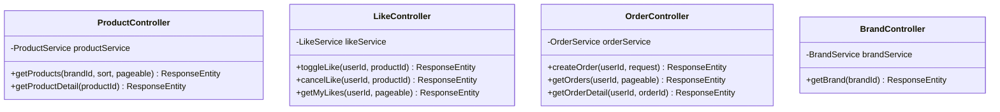

# 03. 클래스 다이어그램

## 1. 도메인 모델 전체 구조


---

## 2. 도메인 객체별 상세 설계

### 2.1 Product (상품)

**책임:**
- 상품 정보 관리
- 재고 차감 및 검증
- 좋아요 수 증감

**주요 메서드:**
```kotlin
class Product(
    val id: Long,
    val name: String,
    val description: String,
    val price: Money,
    var stock: Stock,
    val brand: Brand,
    var likesCount: Int = 0
) {
    fun increaseLikeCount() {
        likesCount++
    }

    fun decreaseLikeCount() {
        if (likesCount > 0) likesCount--
    }

    fun decreaseStock(quantity: Quantity) {
        stock = stock.decrease(quantity)
    }

    fun hasEnoughStock(quantity: Quantity): Boolean {
        return stock.isEnough(quantity)
    }
}
```

---

### 2.2 Order (주문)

**책임:**
- 주문 정보 관리
- 총 금액 계산
- 주문 상태 변경

**주요 메서드:**
```kotlin
class Order(
    val id: Long,
    val userId: String,
    var status: OrderStatus = OrderStatus.PENDING,
    val items: List<OrderItem>
) {
    val totalAmount: Money
        get() = calculateTotalAmount()

    fun calculateTotalAmount(): Money {
        return items.sumOf { it.subtotal }
    }

    fun complete() {
        status = OrderStatus.COMPLETED
    }

    fun fail() {
        status = OrderStatus.FAILED
    }
}

enum class OrderStatus {
    PENDING,
    COMPLETED,
    FAILED,
    CANCELLED
}
```

---

### 2.3 Like (좋아요)

**책임:**
- 사용자-상품 간 좋아요 관계 표현
- 중복 방지 (복합키)

**설계:**
```kotlin
class Like(
    val id: Long,
    val member: Member,
    val product: Product,
    val createdAt: LocalDateTime = LocalDateTime.now()
) {
    // 비즈니스 로직은 단순 - 존재 여부만 중요
    // 중복 방지는 DB 제약조건 (UNIQUE INDEX on member_id, product_id)
}
```

---

### 2.4 Brand (브랜드)

**책임:**
- 브랜드 정보 관리
- 상품 목록 관리

**설계:**
```kotlin
class Brand(
    val id: Long,
    val name: String,
    val description: String,
    val products: List<Product> = emptyList()
)
```

---

## 3. Value Object (VO) 설계

### 3.1 Money (금액)

```kotlin
data class Money(
    val amount: Long
) {
    init {
        require(amount >= 0) { "금액은 0 이상이어야 합니다" }
    }

    operator fun plus(other: Money): Money {
        return Money(this.amount + other.amount)
    }

    operator fun times(multiplier: Int): Money {
        return Money(this.amount * multiplier)
    }
}
```

---

### 3.2 Stock (재고)

```kotlin
data class Stock(
    val quantity: Int
) {
    init {
        require(quantity >= 0) { "재고는 0 이상이어야 합니다" }
    }

    fun decrease(amount: Quantity): Stock {
        require(isEnough(amount)) { "재고가 부족합니다" }
        return Stock(this.quantity - amount.value)
    }

    fun isEnough(amount: Quantity): Boolean {
        return this.quantity >= amount.value
    }
}
```

---

### 3.3 Quantity (수량)

```kotlin
data class Quantity(
    val value: Int
) {
    init {
        require(value > 0) { "수량은 1 이상이어야 합니다" }
    }
}
```

---

## 4. 계층별 클래스 구조

### 4.1 Presentation Layer (Controller)



---

### 4.2 Application Layer (Service)


---

### 4.3 Domain Layer (Entity)


---

### 4.4 Infrastructure Layer (Repository)


---

### 4.5 Exception Layer (예외 처리)


**예외 처리 전략:**
- **ProductNotFoundException**: 존재하지 않는 상품 조회 시 발생 (404)
- **InsufficientStockException**: 재고 부족 시 발생 (400)
- **InsufficientPointException**: 포인트 부족 시 발생 (400)
- **ExternalSystemException**: 외부 시스템 연동 실패 시 발생 (500)
- **InvalidRequestException**: 잘못된 요청 파라미터 시 발생 (400)

**글로벌 예외 핸들러:**
```kotlin
@RestControllerAdvice
class GlobalExceptionHandler {
    @ExceptionHandler(ProductNotFoundException::class)
    fun handleProductNotFound(e: ProductNotFoundException): ResponseEntity<ErrorResponse> {
        return ResponseEntity.status(HttpStatus.NOT_FOUND)
            .body(ErrorResponse(e.errorCode, e.message))
    }

    @ExceptionHandler(InsufficientStockException::class)
    fun handleInsufficientStock(e: InsufficientStockException): ResponseEntity<ErrorResponse> {
        return ResponseEntity.status(HttpStatus.BAD_REQUEST)
            .body(ErrorResponse(e.errorCode, e.message))
    }

    @ExceptionHandler(InsufficientPointException::class)
    fun handleInsufficientPoint(e: InsufficientPointException): ResponseEntity<ErrorResponse> {
        return ResponseEntity.status(HttpStatus.BAD_REQUEST)
            .body(ErrorResponse(e.errorCode, e.message))
    }

    @ExceptionHandler(ExternalSystemException::class)
    fun handleExternalSystemError(e: ExternalSystemException): ResponseEntity<ErrorResponse> {
        return ResponseEntity.status(HttpStatus.INTERNAL_SERVER_ERROR)
            .body(ErrorResponse(e.errorCode, e.message))
    }

    @ExceptionHandler(InvalidRequestException::class)
    fun handleInvalidRequest(e: InvalidRequestException): ResponseEntity<ErrorResponse> {
        return ResponseEntity.status(HttpStatus.BAD_REQUEST)
            .body(ErrorResponse(e.errorCode, e.message))
    }
}
```

---

## 5. 핵심 설계 원칙

### 5.1 단방향 연관관계
- Product → Brand (단방향)
- Like → Member, Product (단방향)
- OrderItem → Product (단방향)
- 양방향 관계는 최소화하여 복잡도 감소

### 5.2 비즈니스 로직의 도메인 배치
- 재고 차감: `Product.decreaseStock()`
- 좋아요 수 증감: `Product.increaseLikeCount()`
- 총 금액 계산: `Order.calculateTotalAmount()`
- Service는 도메인 객체 조율 역할만 수행

### 5.3 Value Object 활용
- `Money`: 금액 연산 및 검증
- `Stock`: 재고 차감 및 검증
- `Quantity`: 수량 검증
- 불변 객체로 설계하여 안전성 보장

### 5.4 책임 분리
- **Entity**: 비즈니스 규칙 및 상태 관리
- **VO**: 값 표현 및 검증
- **Service**: 트랜잭션 및 도메인 객체 조율
- **Repository**: 영속성 관리
- **Reader**: 도메인 객체 조회 및 검증 (읽기 전용)
- **Manager**: 특정 도메인 로직 처리 (재고 관리 등)

### 5.5 예외 처리 원칙
- 비즈니스 예외는 명시적인 Exception 클래스로 표현
- 각 예외는 적절한 HTTP 상태 코드와 매핑
- GlobalExceptionHandler로 일관된 예외 응답 제공
- 외부 시스템 실패는 트랜잭션 롤백과 함께 처리

### 5.6 외부 시스템 연동
- **ExternalOrderClient**: 인터페이스로 추상화
- **ExternalOrderMockClient**: Mock 구현체 제공
- 실제 연동 시 구현체만 교체하면 됨 (DIP 원칙)
- 실패 시 명확한 예외 처리 및 롤백 보장
