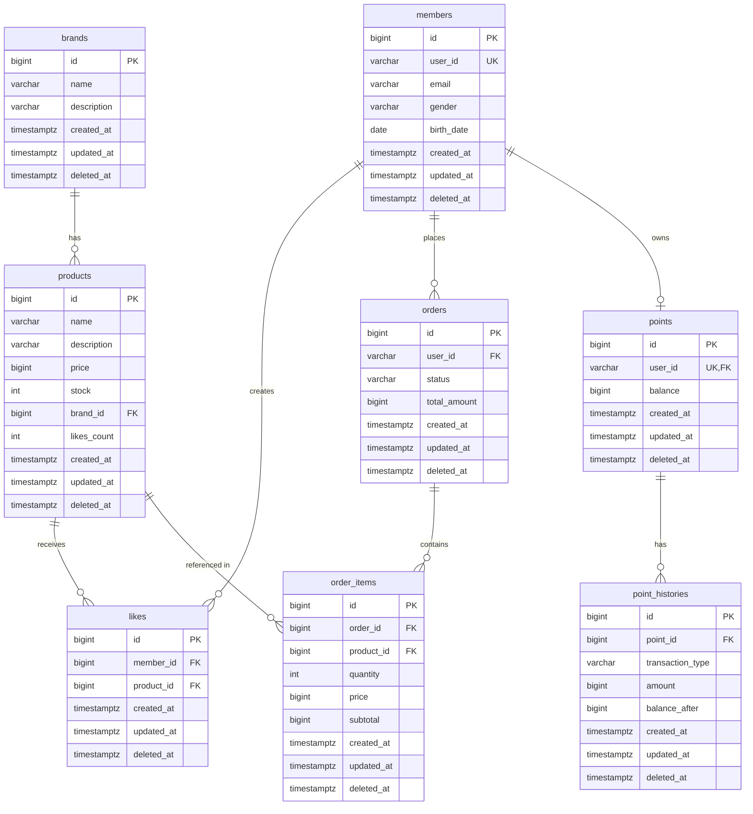

# 04. ERD (Entity Relationship Diagram)

## 1. 전체 ERD



---

## 2. 테이블별 상세 설계

### 2.1 members (회원)

| 컬럼명 | 타입 | 제약조건 | 설명 |
|--------|------|----------|------|
| id | BIGINT | PK, AUTO_INCREMENT | 회원 ID (BaseEntity) |
| user_id | VARCHAR(50) | NOT NULL, UNIQUE | 사용자 식별자 (로그인 ID) |
| email | VARCHAR(100) | NOT NULL | 이메일 |
| gender | VARCHAR(10) | | 성별 (MALE, FEMALE, OTHER) |
| birth_date | DATE | | 생년월일 |
| created_at | TIMESTAMPTZ | NOT NULL | 가입일시 (BaseEntity) |
| updated_at | TIMESTAMPTZ | NOT NULL | 수정일시 (BaseEntity) |
| deleted_at | TIMESTAMPTZ | NULL | 삭제일시 (BaseEntity, Soft Delete) |

**인덱스:**
- `idx_user_id` ON (user_id)

**비고:**
- 1주차에서 이미 구현됨
- X-USER-ID 헤더로 user_id를 전달받아 회원 식별
- BaseEntity 상속으로 id, created_at, updated_at, deleted_at 자동 관리

---

### 2.2 brands (브랜드)

| 컬럼명 | 타입 | 제약조건 | 설명 |
|--------|------|----------|------|
| id | BIGINT | PK, AUTO_INCREMENT | 브랜드 ID |
| name | VARCHAR(100) | NOT NULL | 브랜드명 |
| description | TEXT | | 브랜드 설명 |
| created_at | TIMESTAMP | NOT NULL, DEFAULT CURRENT_TIMESTAMP | 등록일시 |

**인덱스:**
- `idx_name` ON (name)

**비고:**
- 브랜드 데이터는 사전 등록되어 있다고 가정
- 상품 필터링 시 자주 사용되므로 name에 인덱스

---

### 2.3 products (상품)

| 컬럼명 | 타입 | 제약조건 | 설명 |
|--------|------|----------|------|
| id | BIGINT | PK, AUTO_INCREMENT | 상품 ID |
| name | VARCHAR(200) | NOT NULL | 상품명 |
| description | TEXT | | 상품 설명 |
| price | BIGINT | NOT NULL | 가격 (단위: 원) |
| stock | INT | NOT NULL, DEFAULT 0 | 재고 수량 |
| brand_id | BIGINT | FK, NOT NULL | 브랜드 ID |
| likes_count | INT | NOT NULL, DEFAULT 0 | 좋아요 수 (비정규화) |
| created_at | TIMESTAMP | NOT NULL, DEFAULT CURRENT_TIMESTAMP | 등록일시 |

**인덱스:**
- `idx_brand_id` ON (brand_id)
- `idx_created_at` ON (created_at) -- 최신순 정렬
- `idx_price` ON (price) -- 가격순 정렬
- `idx_likes_count` ON (likes_count) -- 좋아요순 정렬

**외래키:**
- `fk_products_brand` FOREIGN KEY (brand_id) REFERENCES brands(id)

**비고:**
- likes_count는 성능을 위해 비정규화 (COUNT 쿼리 최소화)
- stock은 동시성 제어 필요 (비관적 락 or 낙관적 락)

---

### 2.4 likes (좋아요)

| 컬럼명 | 타입 | 제약조건 | 설명 |
|--------|------|----------|------|
| id | BIGINT | PK, AUTO_INCREMENT | 좋아요 ID |
| member_id | BIGINT | FK, NOT NULL | 회원 ID |
| product_id | BIGINT | FK, NOT NULL | 상품 ID |
| created_at | TIMESTAMP | NOT NULL, DEFAULT CURRENT_TIMESTAMP | 좋아요 누른 일시 |

**인덱스:**
- `uk_member_product` UNIQUE ON (member_id, product_id) -- 중복 방지
- `idx_product_id` ON (product_id) -- 상품별 좋아요 조회
- `idx_member_id` ON (member_id) -- 회원별 좋아요 조회

**외래키:**
- `fk_likes_member` FOREIGN KEY (member_id) REFERENCES members(id)
- `fk_likes_product` FOREIGN KEY (product_id) REFERENCES products(id)

**비고:**
- 복합 UNIQUE 인덱스로 멱등성 보장
- 한 사용자는 한 상품에 한 번만 좋아요 가능

---

### 2.5 orders (주문)

| 컬럼명 | 타입 | 제약조건 | 설명 |
|--------|------|----------|------|
| id | BIGINT | PK, AUTO_INCREMENT | 주문 ID |
| user_id | VARCHAR(50) | NOT NULL | 주문자 ID |
| status | VARCHAR(20) | NOT NULL | 주문 상태 (PENDING, COMPLETED, FAILED, CANCELLED) |
| total_amount | BIGINT | NOT NULL | 총 주문 금액 |
| ordered_at | TIMESTAMP | NOT NULL, DEFAULT CURRENT_TIMESTAMP | 주문일시 |

**인덱스:**
- `idx_user_id` ON (user_id)
- `idx_status` ON (status)
- `idx_ordered_at` ON (ordered_at)

**비고:**
- status는 ENUM 대신 VARCHAR 사용 (확장성)
- user_id는 members.user_id를 참조하지만 FK는 미설정 (느슨한 결합)

---

### 2.6 order_items (주문 아이템)

| 컬럼명 | 타입 | 제약조건 | 설명 |
|--------|------|----------|------|
| id | BIGINT | PK, AUTO_INCREMENT | 주문 아이템 ID |
| order_id | BIGINT | FK, NOT NULL | 주문 ID |
| product_id | BIGINT | FK, NOT NULL | 상품 ID |
| quantity | INT | NOT NULL | 주문 수량 |
| price | BIGINT | NOT NULL | 주문 당시 상품 가격 |
| subtotal | BIGINT | NOT NULL | 소계 (price * quantity) |

**인덱스:**
- `idx_order_id` ON (order_id)
- `idx_product_id` ON (product_id)

**외래키:**
- `fk_order_items_order` FOREIGN KEY (order_id) REFERENCES orders(id)
- `fk_order_items_product` FOREIGN KEY (product_id) REFERENCES products(id)

**비고:**
- price는 주문 당시 가격을 저장 (상품 가격 변경과 무관)
- subtotal은 계산값이지만 조회 성능을 위해 저장

---

### 2.7 points (포인트)

| 컬럼명 | 타입 | 제약조건 | 설명 |
|--------|------|----------|------|
| id | BIGINT | PK, AUTO_INCREMENT | 포인트 ID |
| user_id | VARCHAR(50) | NOT NULL, UNIQUE | 사용자 ID |
| balance | BIGINT | NOT NULL, DEFAULT 0 | 현재 잔액 |
| created_at | TIMESTAMP | NOT NULL, DEFAULT CURRENT_TIMESTAMP | 포인트 계정 생성일시 |
| updated_at | TIMESTAMP | NOT NULL, DEFAULT CURRENT_TIMESTAMP ON UPDATE CURRENT_TIMESTAMP | 최종 잔액 변경일시 |

**인덱스:**
- `uk_user_id` UNIQUE ON (user_id)

**비고:**
- 1주차에서 이미 구현됨
- 동시성 제어 필요 (비관적 락)
- 한 사용자당 하나의 포인트 레코드
- created_at: 회원 가입 시 포인트 계정 생성 시간
- updated_at: 포인트 충전/사용으로 잔액 변경 시간

---

### 2.8 point_histories (포인트 이력)

| 컬럼명 | 타입 | 제약조건 | 설명 |
|--------|------|----------|------|
| id | BIGINT | PK, AUTO_INCREMENT | 이력 ID |
| point_id | BIGINT | FK, NOT NULL | 포인트 ID |
| transaction_type | VARCHAR(20) | NOT NULL | 거래 유형 (CHARGE, USE, REFUND) |
| amount | BIGINT | NOT NULL | 거래 금액 |
| balance_after | BIGINT | NOT NULL | 거래 후 잔액 |
| created_at | TIMESTAMP | NOT NULL, DEFAULT CURRENT_TIMESTAMP | 거래일시 |

**인덱스:**
- `idx_point_id` ON (point_id)
- `idx_created_at` ON (created_at)

**외래키:**
- `fk_point_histories_point` FOREIGN KEY (point_id) REFERENCES points(id)

**비고:**
- 포인트 변동 이력을 추적하기 위한 감사 테이블
- balance_after로 특정 시점의 잔액 확인 가능

---

## 3. 주요 제약조건 및 인덱스 전략

### 3.1 중복 방지
- **likes 테이블**: `UNIQUE INDEX (member_id, product_id)` → 멱등성 보장
- **points 테이블**: `UNIQUE INDEX (user_id)` → 사용자당 하나의 포인트

### 3.2 조회 성능 최적화
- **products 테이블**:
  - `idx_brand_id`: 브랜드별 필터링
  - `idx_created_at`: 최신순 정렬
  - `idx_price`: 가격순 정렬
  - `idx_likes_count`: 좋아요순 정렬
- **orders 테이블**:
  - `idx_user_id`: 사용자별 주문 조회
  - `idx_ordered_at`: 주문 일시 정렬

### 3.3 참조 무결성
- 외래키 설정으로 데이터 정합성 보장
- CASCADE 옵션은 신중하게 사용 (기본적으로 RESTRICT)

### 3.4 동시성 제어
- **products.stock**: 재고 차감 시 비관적 락 (`SELECT FOR UPDATE`)
  - 동시 주문 시 재고 부족 오류 방지
  - 트랜잭션 격리 수준: REPEATABLE_READ 이상
- **points.balance**: 포인트 차감 시 비관적 락 (`SELECT FOR UPDATE`)
  - 동시 주문 시 포인트 부족 오류 방지
  - 트랜잭션 격리 수준: REPEATABLE_READ 이상

### 3.5 데이터 정합성 검증
- **주문 생성 시 검증 순서**:
  1. 상품 존재 여부 확인 (products 테이블)
  2. 재고 확인 (products.stock >= 요청 수량)
  3. 포인트 잔액 확인 (points.balance >= 총 금액)
  4. 트랜잭션 시작 후 재고/포인트 차감
  5. 외부 시스템 연동 실패 시 전체 롤백

---

## 4. 데이터 타입 선택 근거

### 4.1 BIGINT vs INT
- **BIGINT**: id, price, amount → 큰 범위 필요
- **INT**: stock, quantity, likes_count → 충분한 범위

### 4.2 VARCHAR vs TEXT
- **VARCHAR(n)**: 길이 제한이 있는 값 (name, email, status)
- **TEXT**: 긴 텍스트 (description)

### 4.3 TIMESTAMP
- 모든 일시 정보는 `TIMESTAMP` 사용
- 자동 업데이트가 필요한 경우 `ON UPDATE CURRENT_TIMESTAMP` 활용

---

## 5. 정규화 vs 비정규화

### 5.1 비정규화 사례

**products.likes_count**
- 정규화: likes 테이블에서 COUNT 쿼리
- 비정규화: products 테이블에 likes_count 컬럼 추가
- 이유: 상품 목록 조회 시 성능 최적화

**order_items.price**
- 현재 상품 가격과 무관하게 주문 당시 가격 저장
- 이유: 과거 주문 정보의 정확성 보장

### 5.2 정규화 유지

**members, brands, products**
- 기본적인 정규화 유지
- 중복 데이터 최소화

---

## 6. 샘플 데이터

### brands
```sql
INSERT INTO brands (name, description) VALUES
('감성브랜드', '감성을 담은 브랜드'),
('모던브랜드', '모던한 디자인의 브랜드');
```

### products
```sql
INSERT INTO products (name, description, price, stock, brand_id, likes_count) VALUES
('감성 티셔츠', '편안한 착용감의 감성 티셔츠', 29000, 100, 1, 0),
('감성 후드', '따뜻한 감성 후드', 49000, 50, 1, 0),
('모던 셔츠', '심플한 모던 셔츠', 39000, 80, 2, 0);
```

---

## 7. 마이그레이션 고려사항

### 7.1 테이블 생성 순서
1. members (1주차 완료)
2. points (1주차 완료)
3. brands
4. products
5. likes
6. orders
7. order_items
8. point_histories

### 7.2 인덱스 추가 시점
- 초기: PK, FK, UNIQUE 인덱스만 생성
- 성능 테스트 후: 조회 성능 개선을 위한 인덱스 추가

---

## 8. 주요 쿼리 예시

### 8.1 상품 목록 조회 (브랜드 필터링 + 좋아요순)
```sql
SELECT p.*, b.name as brand_name
FROM products p
JOIN brands b ON p.brand_id = b.id
WHERE p.brand_id = ?
ORDER BY p.likes_count DESC
LIMIT ? OFFSET ?;
```

### 8.2 좋아요 중복 확인 (멱등성)
```sql
SELECT COUNT(*)
FROM likes
WHERE member_id = ? AND product_id = ?;
```

### 8.3 주문 생성 시 재고 확인 및 차감 (동시성 제어)
```sql
-- 비관적 락
SELECT stock FROM products WHERE id = ? FOR UPDATE;

-- 재고 차감
UPDATE products SET stock = stock - ? WHERE id = ?;
```

### 8.4 포인트 차감 (동시성 제어)
```sql
-- 비관적 락
SELECT balance FROM points WHERE user_id = ? FOR UPDATE;

-- 포인트 잔액 확인
-- balance < 차감할 금액이면 InsufficientPointException 발생

-- 포인트 차감
UPDATE points SET balance = balance - ? WHERE user_id = ?;
```

### 8.5 좋아요 등록 (멱등성 보장)
```sql
-- 좋아요 중복 확인
SELECT id FROM likes WHERE member_id = ? AND product_id = ?;

-- 이미 존재하면 추가 등록하지 않고 성공 응답 (멱등성)
-- 존재하지 않으면 INSERT
INSERT INTO likes (member_id, product_id, created_at)
VALUES (?, ?, NOW());

-- 좋아요 수 증가
UPDATE products SET likes_count = likes_count + 1 WHERE id = ?;
```

### 8.6 주문 생성 트랜잭션 (전체 흐름)
```sql
-- 1. 트랜잭션 시작
START TRANSACTION;

-- 2. 상품 존재 확인
SELECT id, name, price FROM products WHERE id IN (?, ?, ...);
-- 존재하지 않으면 ProductNotFoundException 발생 후 ROLLBACK

-- 3. 재고 확인 및 차감 (비관적 락)
SELECT stock FROM products WHERE id = ? FOR UPDATE;
-- stock < 요청 수량이면 InsufficientStockException 발생 후 ROLLBACK
UPDATE products SET stock = stock - ? WHERE id = ?;

-- 4. 포인트 확인 및 차감 (비관적 락)
SELECT balance FROM points WHERE user_id = ? FOR UPDATE;
-- balance < 총 금액이면 InsufficientPointException 발생 후 ROLLBACK
UPDATE points SET balance = balance - ? WHERE user_id = ?;

-- 5. 주문 생성
INSERT INTO orders (user_id, status, total_amount, ordered_at)
VALUES (?, 'PENDING', ?, NOW());

-- 6. 주문 아이템 생성
INSERT INTO order_items (order_id, product_id, quantity, price, subtotal)
VALUES (?, ?, ?, ?, ?);

-- 7. 외부 시스템 연동
-- 성공 시: 주문 상태 COMPLETED로 변경
UPDATE orders SET status = 'COMPLETED' WHERE id = ?;
COMMIT;

-- 실패 시: 전체 ROLLBACK, 주문 상태 FAILED로 변경
ROLLBACK;
UPDATE orders SET status = 'FAILED' WHERE id = ?;
```

---

## 9. 에러 시나리오별 처리

### 9.1 상품 미존재
- **시나리오**: 존재하지 않는 productId로 조회/좋아요/주문 시도
- **처리**: ProductNotFoundException 발생 → 404 Not Found 응답
- **DB 영향**: 없음 (조회만 실패)

### 9.2 재고 부족
- **시나리오**: 주문 수량 > 현재 재고
- **처리**: InsufficientStockException 발생 → 400 Bad Request 응답
- **DB 영향**: 트랜잭션 시작 전 검증 실패 → 롤백 불필요

### 9.3 포인트 부족
- **시나리오**: 주문 금액 > 보유 포인트
- **처리**: InsufficientPointException 발생 → 400 Bad Request 응답
- **DB 영향**: 트랜잭션 시작 전 검증 실패 → 롤백 불필요

### 9.4 외부 시스템 연동 실패
- **시나리오**: ExternalOrderClient.sendOrder() 실패
- **처리**: ExternalSystemException 발생 → 500 Internal Server Error 응답
- **DB 영향**: 전체 트랜잭션 롤백 (재고, 포인트, 주문 복원)

### 9.5 좋아요 중복 등록
- **시나리오**: 이미 좋아요한 상품에 다시 좋아요 시도
- **처리**: 멱등성 보장 → 200 OK 응답 (중복 생성 없음)
- **DB 영향**: UNIQUE 제약조건으로 중복 방지

### 9.6 동시 주문 충돌
- **시나리오**: 여러 사용자가 동시에 마지막 재고 주문
- **처리**: 비관적 락으로 순차 처리, 늦은 사용자는 재고 부족 오류
- **DB 영향**: SELECT FOR UPDATE로 동시성 제어

---

## 10. 인덱스 효과 분석

### 10.1 products 테이블 인덱스
```sql
-- 브랜드별 상품 조회
EXPLAIN SELECT * FROM products WHERE brand_id = 1;
-- KEY: idx_brand_id (효과적)

-- 최신순 정렬
EXPLAIN SELECT * FROM products ORDER BY created_at DESC LIMIT 20;
-- KEY: idx_created_at (효과적)

-- 좋아요순 정렬
EXPLAIN SELECT * FROM products ORDER BY likes_count DESC LIMIT 20;
-- KEY: idx_likes_count (효과적)
```

### 10.2 likes 테이블 인덱스
```sql
-- 좋아요 중복 확인
EXPLAIN SELECT id FROM likes WHERE member_id = 1 AND product_id = 100;
-- KEY: uk_member_product (UNIQUE, 효과적)

-- 내가 좋아요한 상품 조회
EXPLAIN SELECT * FROM likes WHERE member_id = 1 ORDER BY created_at DESC;
-- KEY: idx_member_id (효과적)
```

### 10.3 orders 테이블 인덱스
```sql
-- 사용자별 주문 조회
EXPLAIN SELECT * FROM orders WHERE user_id = 'user123' ORDER BY ordered_at DESC;
-- KEY: idx_user_id (효과적)
```
