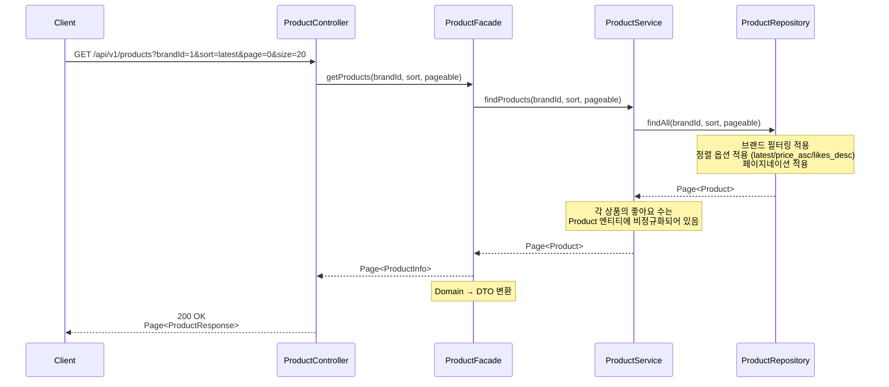
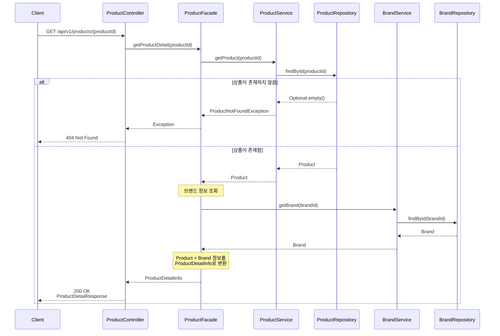
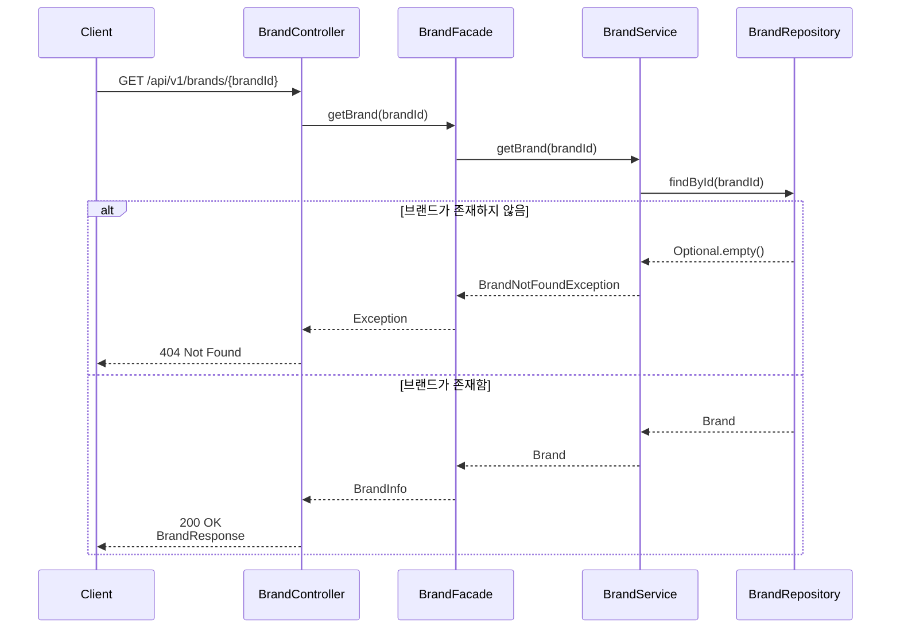
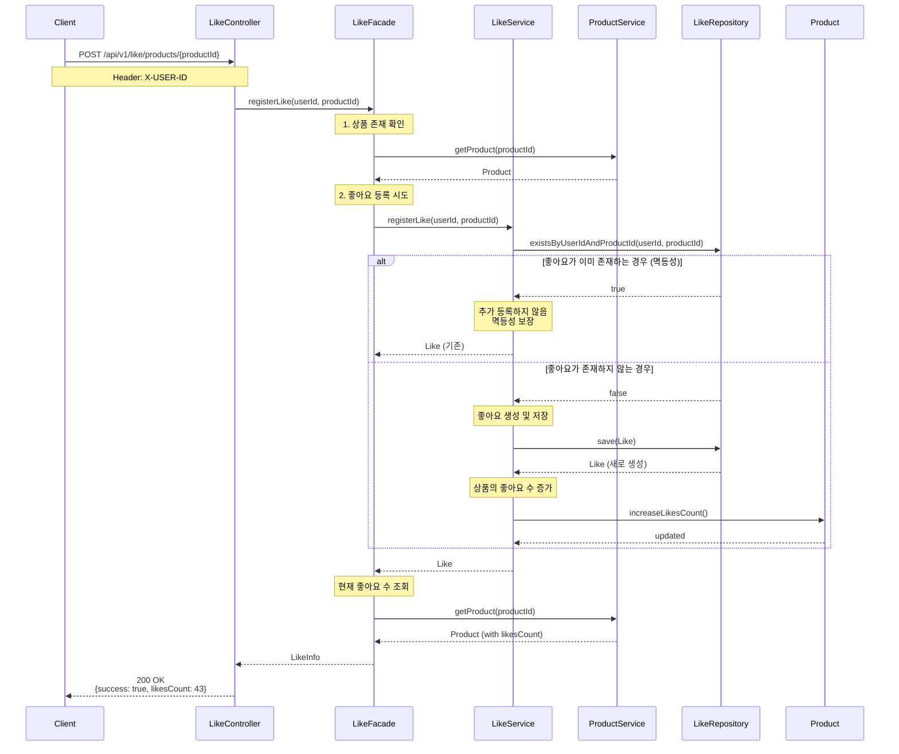
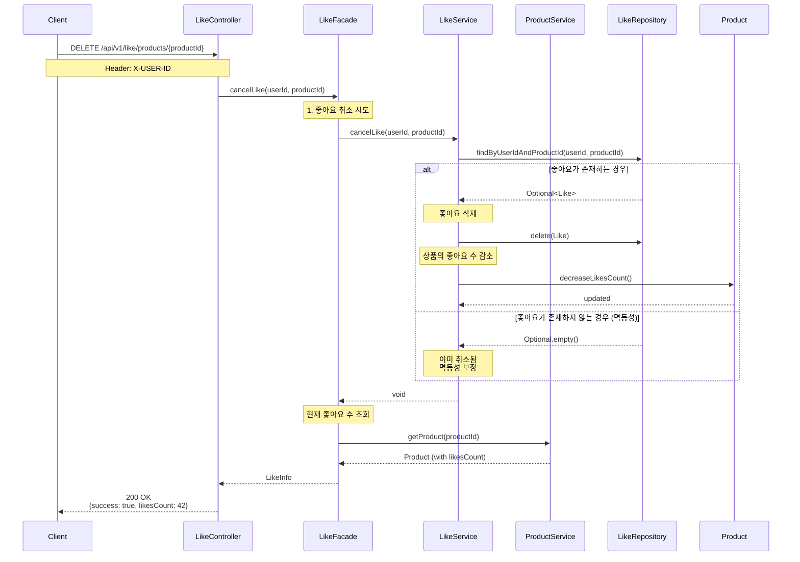
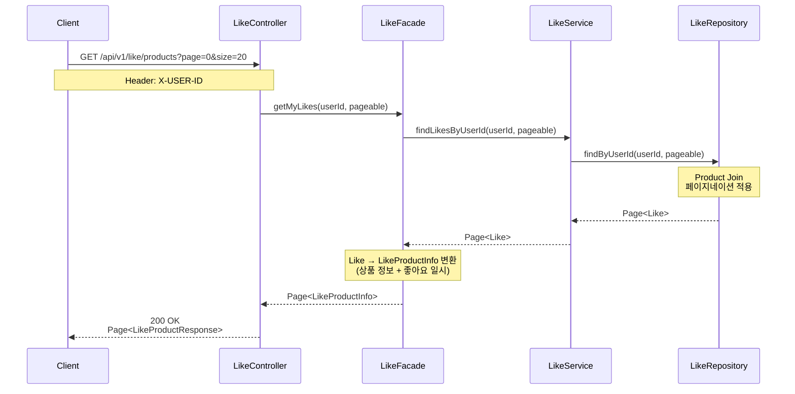
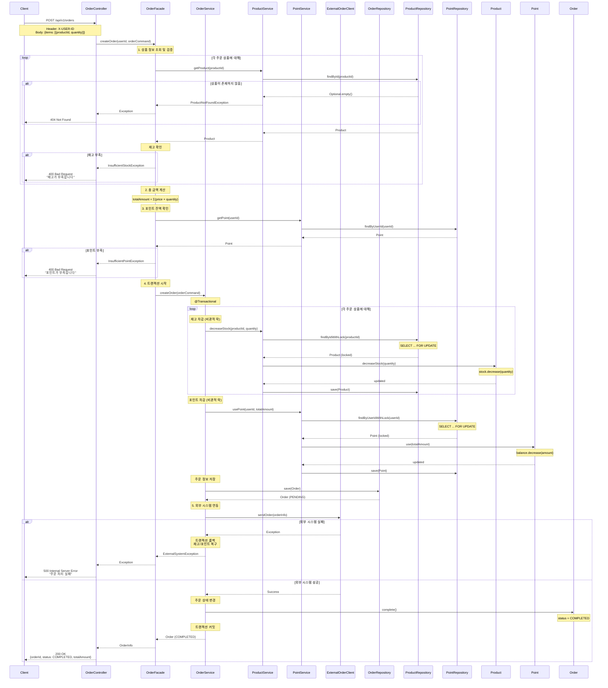
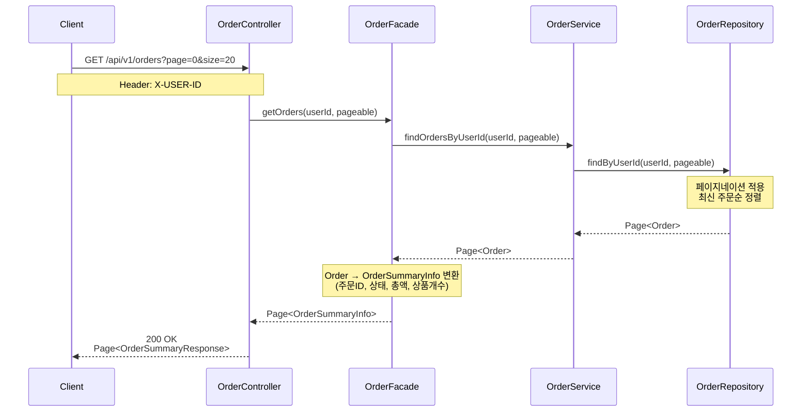
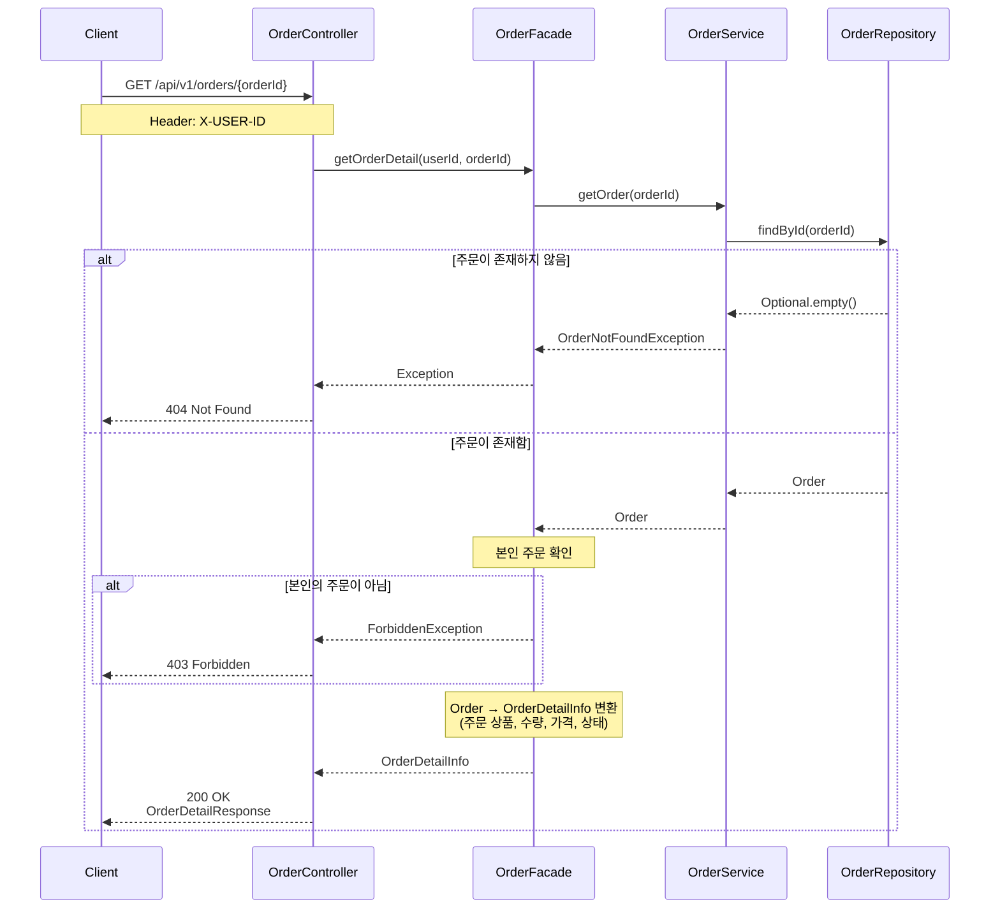

# 02. 시퀀스 다이어그램

## 개요

이 문서는 감성 이커머스의 주요 기능에 대한 시퀀스 다이어그램을 정리합니다.
객체 간 메시지 흐름을 통해 책임과 협력 구조를 시각화합니다.

**설계 범위:**
- 상품 조회 (목록, 상세)
- 브랜드 조회
- 좋아요 등록/취소 (멱등성)
- 주문 생성 및 결제

---

## 1. 상품 목록 조회 (브랜드 필터링 및 정렬)

### 시나리오
사용자가 브랜드 필터링과 정렬 옵션을 적용하여 상품 목록을 조회합니다.

**핵심 포인트:**
- 브랜드 필터링은 Query Parameter로 선택적으로 적용
- 정렬 기준: `latest` (필수), `price_asc`, `likes_desc` (선택)
- 좋아요 수는 Product 테이블에 비정규화하여 COUNT 쿼리 최소화
- Facade 계층에서 Domain 객체를 DTO로 변환

---

## 2. 상품 상세 조회

### 시나리오
사용자가 특정 상품의 상세 정보를 조회합니다. 브랜드 정보와 좋아요 수가 포함됩니다.

**핵심 포인트:**
- 상품이 없으면 404 Not Found 반환
- 브랜드 정보는 별도 Service를 통해 조회
- Facade에서 Product와 Brand를 조합하여 상세 정보 생성

---

## 3. 브랜드 조회

### 시나리오
사용자가 특정 브랜드의 정보를 조회합니다.

**핵심 포인트:**
- 단순 조회 흐름
- 브랜드가 없으면 404 반환

---

## 4. 상품 좋아요 등록 (멱등성 보장)

### 시나리오
사용자가 상품에 좋아요를 등록합니다. 이미 좋아요가 있으면 추가 등록하지 않습니다 (멱등성).

**핵심 포인트:**
- **멱등성**: 이미 좋아요가 있으면 추가 등록하지 않음
- DB 제약조건: UNIQUE INDEX (user_id, product_id)로 중복 방지
- 좋아요 수는 Product 엔티티에서 관리
- 동일한 요청을 여러 번 보내도 동일한 결과

---

## 5. 상품 좋아요 취소 (멱등성 보장)

### 시나리오
사용자가 상품의 좋아요를 취소합니다. 좋아요가 없어도 성공 응답을 반환합니다 (멱등성).

**핵심 포인트:**
- **멱등성**: 좋아요가 없어도 성공 응답
- 중복 취소 요청에도 동일한 결과
- 좋아요 수 감소는 실제 삭제된 경우만 수행

---

## 6. 내가 좋아요한 상품 목록 조회

### 시나리오
사용자가 자신이 좋아요한 상품 목록을 조회합니다.

**핵심 포인트:**
- 페이지네이션 적용
- Product와 Join하여 상품 정보도 함께 반환
- 좋아요 누른 일시 포함

---

## 7. 주문 생성 및 결제 (핵심 시퀀스)

### 시나리오
사용자가 여러 상품을 주문하고, 재고 차감 → 포인트 차감 → 외부 시스템 연동을 거쳐 주문이 완료되는 전체 흐름입니다.

**핵심 포인트:**
1. **상품 검증**: 모든 상품이 존재하고 재고가 충분한지 확인
2. **포인트 검증**: 잔액이 충분한지 확인
3. **트랜잭션**: 재고 차감 → 포인트 차감 → 주문 저장이 하나의 트랜잭션
4. **동시성 제어**: 재고/포인트 차감 시 비관적 락 (`SELECT FOR UPDATE`)
5. **외부 시스템**: 실패 시 전체 롤백
6. **주문 상태**: `PENDING` → `COMPLETED` or `FAILED`

---

## 8. 주문 목록 조회

### 시나리오
사용자가 자신의 주문 내역을 조회합니다.

**핵심 포인트:**
- 본인의 주문만 조회 (userId로 필터링)
- 페이지네이션 적용
- 요약 정보만 반환 (상세는 별도 API)

---

## 9. 주문 상세 조회

### 시나리오
사용자가 특정 주문의 상세 정보를 조회합니다.

**핵심 포인트:**
- 본인의 주문만 조회 가능 (권한 검증)
- 주문 상품 상세 정보 포함
- 주문이 없거나 권한이 없으면 에러 반환

---

## 설계 원칙 정리

### 1. 계층별 책임 분리
- **Controller**: HTTP 요청/응답 처리, 헤더 파싱
- **Facade**: 여러 Service 조율, Domain → DTO 변환
- **Service**: 비즈니스 로직, 트랜잭션 관리
- **Domain**: 핵심 비즈니스 규칙 (재고 차감, 좋아요 카운트)
- **Repository**: 데이터 접근

### 2. 멱등성 보장
- 좋아요 등록: 이미 존재하면 추가 등록하지 않음
- 좋아요 취소: 존재하지 않아도 성공 응답
- DB 제약조건으로 중복 방지

### 3. 트랜잭션 관리
- 주문 생성은 하나의 트랜잭션
- 재고/포인트 차감 → 주문 저장 → 외부 시스템
- 실패 시 전체 롤백

### 4. 동시성 제어
- 재고 차감: 비관적 락 (`SELECT FOR UPDATE`)
- 포인트 차감: 비관적 락 (`SELECT FOR UPDATE`)
- 동시 주문 시 정합성 보장

### 5. 성능 최적화
- 좋아요 수 비정규화 (Product 테이블에 저장)
- 페이지네이션으로 대용량 데이터 처리
- 인덱스 활용 (브랜드 필터링, 정렬)

---

## 다음 단계

이 시퀀스 다이어그램을 기반으로:
1. **클래스 다이어그램**: 객체 구조와 책임 정의
2. **ERD**: 데이터베이스 테이블 설계
3. **구현**: 실제 코드 작성

