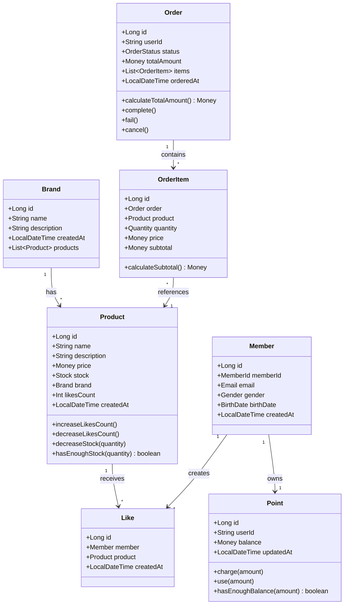
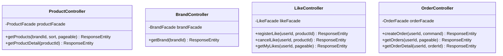
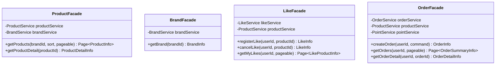
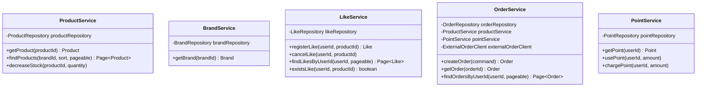
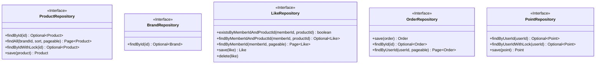

# 03. 클래스 다이어그램

## 개요

이 문서는 감성 이커머스의 도메인 객체 구조와 계층별 클래스 설계를 정리합니다.
도메인 주도 설계(DDD) 원칙에 따라 Entity, Value Object, Service, Repository를 구분합니다.

**설계 범위:**
- 상품/브랜드 도메인
- 좋아요 도메인
- 주문 도메인
- (회원/포인트는 1주차 완료 - 참조용으로만 포함)

---

## 1. 도메인 모델 전체 구조



**관계 설명:**
- Brand는 여러 Product를 가짐 (1:N)
- Product는 여러 Like를 받음 (1:N)
- Member는 여러 Like를 생성 (1:N)
- Order는 여러 OrderItem을 포함 (1:N)
- OrderItem은 Product를 참조 (N:1)
- Member는 하나의 Point를 소유 (1:1)

---

## 2. 도메인 객체 상세 설계

### 2.1 Product (상품)

**책임:**
- 상품 정보 관리
- 재고 차감 및 검증
- 좋아요 수 증감

**주요 속성 및 메서드:**
```kotlin
class Product(
    val id: Long,
    val name: String,
    val description: String,
    val price: Money,
    var stock: Stock,
    val brand: Brand,
    var likesCount: Int = 0,
    val createdAt: LocalDateTime = LocalDateTime.now()
) : BaseEntity() {

    /**
     * 좋아요 수 증가
     */
    fun increaseLikesCount() {
        likesCount++
    }

    /**
     * 좋아요 수 감소
     * 0 이하로는 내려가지 않음
     */
    fun decreaseLikesCount() {
        if (likesCount > 0) {
            likesCount--
        }
    }

    /**
     * 재고 차감
     * @throws InsufficientStockException 재고 부족 시
     */
    fun decreaseStock(quantity: Quantity) {
        if (!hasEnoughStock(quantity)) {
            throw InsufficientStockException("재고가 부족합니다.")
        }
        stock = stock.decrease(quantity)
    }

    /**
     * 재고 충분 여부 확인
     */
    fun hasEnoughStock(quantity: Quantity): Boolean {
        return stock.isEnough(quantity)
    }
}
```

**설계 포인트:**
- 재고 차감 로직은 Product가 직접 수행 (도메인 책임)
- 좋아요 수는 비정규화하여 조회 성능 최적화
- Stock은 Value Object로 분리하여 재고 관련 로직 캡슐화

---

### 2.2 Brand (브랜드)

**책임:**
- 브랜드 정보 관리
- 상품 목록 관리 (선택적)

**주요 속성:**
```kotlin
class Brand(
    val id: Long,
    val name: String,
    val description: String,
    val createdAt: LocalDateTime = LocalDateTime.now()
) : BaseEntity() {
    
    // 양방향 관계는 필요시에만 사용
    // val products: List<Product> = emptyList()
}
```

**설계 포인트:**
- 단순한 정보성 엔티티
- Product와의 양방향 관계는 최소화 (단방향 선호)

---

### 2.3 Like (좋아요)

**책임:**
- 사용자-상품 간 좋아요 관계 표현
- 중복 방지 (복합키)

**주요 속성:**
```kotlin
class Like(
    val id: Long,
    val member: Member,
    val product: Product,
    val createdAt: LocalDateTime = LocalDateTime.now()
) : BaseEntity() {
    
    init {
        // 생성 시 상품의 좋아요 수 증가는 Service에서 처리
    }
}
```

**설계 포인트:**
- 비즈니스 로직은 단순 (존재 여부만 중요)
- 중복 방지는 DB 제약조건 (UNIQUE INDEX on member_id, product_id)
- 멱등성 보장을 위해 존재 여부 확인 후 생성

---

### 2.4 Order (주문)

**책임:**
- 주문 정보 관리
- 총 금액 계산
- 주문 상태 변경

**주요 속성 및 메서드:**
```kotlin
class Order(
    val id: Long,
    val userId: String,
    var status: OrderStatus = OrderStatus.PENDING,
    val items: MutableList<OrderItem> = mutableListOf(),
    val orderedAt: LocalDateTime = LocalDateTime.now()
) : BaseEntity() {

    /**
     * 총 금액 계산
     */
    val totalAmount: Money
        get() = calculateTotalAmount()

    private fun calculateTotalAmount(): Money {
        return items
            .map { it.subtotal }
            .fold(Money.ZERO) { acc, money -> acc + money }
    }

    /**
     * 주문 아이템 추가
     */
    fun addItem(orderItem: OrderItem) {
        items.add(orderItem)
    }

    /**
     * 주문 완료
     */
    fun complete() {
        if (status != OrderStatus.PENDING) {
            throw IllegalStateException("PENDING 상태에서만 완료할 수 있습니다.")
        }
        status = OrderStatus.COMPLETED
    }

    /**
     * 주문 실패
     */
    fun fail() {
        status = OrderStatus.FAILED
    }

    /**
     * 주문 취소 (향후 확장)
     */
    fun cancel() {
        if (status != OrderStatus.COMPLETED) {
            throw IllegalStateException("완료된 주문만 취소할 수 있습니다.")
        }
        status = OrderStatus.CANCELLED
    }
}

enum class OrderStatus {
    PENDING,    // 주문 생성, 결제 대기
    COMPLETED,  // 결제 완료
    FAILED,     // 주문 실패
    CANCELLED   // 사용자 취소
}
```

**설계 포인트:**
- 총 금액은 OrderItem의 subtotal 합계로 계산
- 상태 변경은 Order가 직접 관리 (상태 전이 규칙 검증)
- OrderItem은 Order에 종속 (Aggregate Root)

---

### 2.5 OrderItem (주문 아이템)

**책임:**
- 주문에 포함된 개별 상품 정보
- 소계 금액 계산

**주요 속성 및 메서드:**
```kotlin
class OrderItem(
    val id: Long,
    val order: Order,
    val product: Product,
    val quantity: Quantity,
    val price: Money, // 주문 당시 가격 (상품 가격 변경과 무관)
    val createdAt: LocalDateTime = LocalDateTime.now()
) : BaseEntity() {

    /**
     * 소계 금액 계산
     */
    val subtotal: Money
        get() = calculateSubtotal()

    private fun calculateSubtotal(): Money {
        return price * quantity.value
    }
}
```

**설계 포인트:**
- price는 주문 당시 상품 가격을 저장 (과거 주문 정보 보존)
- subtotal은 계산값이지만 조회 성능을 위해 DB에도 저장 가능
- Order의 일부로 관리 (Aggregate)

---

### 2.6 Member (회원 - 1주차 완료)

**참고용으로만 포함**

```kotlin
class Member(
    val id: Long,
    val memberId: MemberId,
    val email: Email,
    val gender: Gender,
    val birthDate: BirthDate,
    val createdAt: LocalDateTime = LocalDateTime.now()
) : BaseEntity()

enum class Gender {
    MALE, FEMALE, OTHER
}
```

---

### 2.7 Point (포인트 - 1주차 완료)

**참고용으로만 포함**

```kotlin
class Point(
    val id: Long,
    val userId: String,
    var balance: Money,
    var updatedAt: LocalDateTime = LocalDateTime.now()
) : BaseEntity() {

    fun charge(amount: Money) {
        balance = balance + amount
        updatedAt = LocalDateTime.now()
    }

    fun use(amount: Money) {
        if (!hasEnoughBalance(amount)) {
            throw InsufficientPointException("포인트가 부족합니다.")
        }
        balance = balance - amount
        updatedAt = LocalDateTime.now()
    }

    fun hasEnoughBalance(amount: Money): Boolean {
        return balance >= amount
    }
}
```

---

## 3. Value Object (VO) 설계

### 3.1 Money (금액)

**책임:**
- 금액 표현 및 연산
- 금액 유효성 검증

```kotlin
@Embeddable
data class Money(
    val amount: Long
) {
    init {
        require(amount >= 0) { "금액은 0 이상이어야 합니다." }
    }

    operator fun plus(other: Money): Money {
        return Money(this.amount + other.amount)
    }

    operator fun minus(other: Money): Money {
        return Money(this.amount - other.amount)
    }

    operator fun times(multiplier: Int): Money {
        return Money(this.amount * multiplier)
    }

    operator fun compareTo(other: Money): Int {
        return this.amount.compareTo(other.amount)
    }

    companion object {
        val ZERO = Money(0)
    }
}
```

**설계 포인트:**
- 불변 객체 (Immutable)
- 음수 금액 방지
- 연산자 오버로딩으로 직관적인 사용

---

### 3.2 Stock (재고)

**책임:**
- 재고 수량 표현
- 재고 차감 및 검증

```kotlin
@Embeddable
data class Stock(
    val quantity: Int
) {
    init {
        require(quantity >= 0) { "재고는 0 이상이어야 합니다." }
    }

    /**
     * 재고 차감
     * @throws InsufficientStockException 재고 부족 시
     */
    fun decrease(amount: Quantity): Stock {
        require(isEnough(amount)) { "재고가 부족합니다." }
        return Stock(this.quantity - amount.value)
    }

    /**
     * 재고 증가 (향후 확장 - 반품/취소)
     */
    fun increase(amount: Quantity): Stock {
        return Stock(this.quantity + amount.value)
    }

    /**
     * 재고 충분 여부 확인
     */
    fun isEnough(amount: Quantity): Boolean {
        return this.quantity >= amount.value
    }

    companion object {
        val ZERO = Stock(0)
    }
}
```

**설계 포인트:**
- 불변 객체
- 음수 재고 방지
- 재고 관련 로직 캡슐화

---

### 3.3 Quantity (수량)

**책임:**
- 주문 수량 표현
- 수량 유효성 검증

```kotlin
@Embeddable
data class Quantity(
    val value: Int
) {
    init {
        require(value > 0) { "수량은 1 이상이어야 합니다." }
    }

    operator fun times(price: Money): Money {
        return price * value
    }
}
```

**설계 포인트:**
- 불변 객체
- 1 이상의 양수만 허용
- 주문 수량은 0이 될 수 없음

---

### 3.4 MemberId (회원 ID - 1주차 완료)

```kotlin
@Embeddable
data class MemberId(
    val value: String
) {
    init {
        require(value.isNotBlank()) { "회원 ID는 비어있을 수 없습니다." }
        require(value.length in 4..20) { "회원 ID는 4~20자여야 합니다." }
    }
}
```

---

### 3.5 Email (이메일 - 1주차 완료)

```kotlin
@Embeddable
data class Email(
    val value: String
) {
    init {
        require(value.matches(EMAIL_REGEX)) { "유효하지 않은 이메일 형식입니다." }
    }

    companion object {
        private val EMAIL_REGEX = "^[A-Za-z0-9+_.-]+@[A-Za-z0-9.-]+\\.[A-Za-z]{2,}\$".toRegex()
    }
}
```

---

### 3.6 BirthDate (생년월일 - 1주차 완료)

```kotlin
@Embeddable
data class BirthDate(
    val value: LocalDate
) {
    init {
        require(value.isBefore(LocalDate.now())) { "생년월일은 과거 날짜여야 합니다." }
    }
}
```

---

## 4. 계층별 클래스 구조

### 4.1 Presentation Layer (Controller)



**책임:**
- HTTP 요청/응답 처리
- 헤더 파싱 (X-USER-ID)
- 요청 유효성 검증 (Bean Validation)
- 예외 처리 및 에러 응답

---

### 4.2 Application Layer (Facade)



**책임:**
- 여러 Service 조율
- Domain 객체 → DTO 변환
- 트랜잭션 경계 설정 (선택적)
- 복잡한 비즈니스 흐름 조율

**설계 포인트:**
- Facade는 여러 Service를 조합하여 사용
- DTO 변환은 Facade에서 수행 (Controller는 순수 HTTP 처리)
- Service 간 의존성 최소화

---

### 4.3 Domain Layer (Service)



**책임:**
- 핵심 비즈니스 로직
- 트랜잭션 관리 (`@Transactional`)
- 도메인 객체 조율
- Repository를 통한 영속성 처리

**설계 포인트:**
- Service는 도메인 로직을 조율 (직접 수행 X)
- 복잡한 로직은 도메인 객체에 위임
- 단일 책임 원칙 준수

---

### 4.4 Infrastructure Layer (Repository)



**책임:**
- 데이터 영속성 처리
- 쿼리 수행
- JPA Entity 변환

**설계 포인트:**
- 인터페이스로 정의하여 구현체 교체 가능
- 동시성 제어를 위한 락 메서드 제공 (`WithLock`)
- QueryDSL을 활용한 동적 쿼리 (복잡한 조건)

---

## 5. 외부 시스템 연동

### 5.1 ExternalOrderClient (외부 주문 시스템)

```kotlin
interface ExternalOrderClient {
    /**
     * 주문 정보를 외부 시스템에 전송
     * @throws ExternalSystemException 외부 시스템 실패 시
     */
    fun sendOrder(orderInfo: OrderExternalInfo)
}

/**
 * Mock 구현체
 */
@Component
class MockExternalOrderClient : ExternalOrderClient {
    override fun sendOrder(orderInfo: OrderExternalInfo) {
        // Mock 처리
        logger.info("외부 시스템 전송 (Mock): $orderInfo")
        
        // 실패 시나리오 테스트용
        // throw ExternalSystemException("외부 시스템 연동 실패")
    }
}
```

**설계 포인트:**
- 인터페이스로 추상화하여 실제 구현체 교체 가능
- Mock 구현체로 개발/테스트 진행
- 실패 시 Exception 발생하여 트랜잭션 롤백

---

## 6. DTO (Data Transfer Object)

### 6.1 Info (Application Layer DTO)

```kotlin
// Facade → Controller
data class ProductInfo(
    val id: Long,
    val name: String,
    val price: Long,
    val stock: Int,
    val brandId: Long,
    val brandName: String,
    val likesCount: Int,
    val createdAt: LocalDateTime
)

data class ProductDetailInfo(
    val id: Long,
    val name: String,
    val description: String,
    val price: Long,
    val stock: Int,
    val brand: BrandInfo,
    val likesCount: Int,
    val createdAt: LocalDateTime
)

data class LikeInfo(
    val success: Boolean,
    val message: String,
    val likesCount: Int
)

data class OrderInfo(
    val orderId: Long,
    val userId: String,
    val status: String,
    val totalAmount: Long,
    val usedPoints: Long,
    val items: List<OrderItemInfo>,
    val orderedAt: LocalDateTime
)
```

### 6.2 Command (Application Layer Input)

```kotlin
// Controller → Facade
data class CreateOrderCommand(
    val userId: String,
    val items: List<OrderItemCommand>
)

data class OrderItemCommand(
    val productId: Long,
    val quantity: Int
)
```

### 6.3 Response (Presentation Layer DTO)

```kotlin
// Controller → Client
data class ProductResponse(
    val id: Long,
    val name: String,
    val price: Long,
    val stock: Int,
    val brandId: Long,
    val brandName: String,
    val likesCount: Int,
    val createdAt: String
)

data class ApiResponse<T>(
    val success: Boolean,
    val data: T?,
    val message: String? = null
)
```

---

## 7. 핵심 설계 원칙

### 7.1 단방향 연관관계 선호
- Product → Brand (단방향)
- Like → Member, Product (단방향)
- OrderItem → Product (단방향)
- 양방향 관계는 최소화하여 복잡도 감소

### 7.2 비즈니스 로직의 도메인 배치
- 재고 차감: `Product.decreaseStock()`
- 좋아요 수 증감: `Product.increaseLikesCount()`
- 총 금액 계산: `Order.calculateTotalAmount()`
- 포인트 차감: `Point.use()`
- Service는 도메인 객체 조율 역할만 수행

### 7.3 Value Object 활용
- `Money`: 금액 연산 및 검증
- `Stock`: 재고 차감 및 검증
- `Quantity`: 수량 검증
- 불변 객체로 설계하여 안전성 보장

### 7.4 Aggregate 패턴
- Order가 OrderItem을 관리 (Aggregate Root)
- OrderItem은 Order 없이 독립적으로 존재할 수 없음
- 트랜잭션 경계는 Aggregate 단위

### 7.5 책임 분리
- **Entity**: 비즈니스 규칙 및 상태 관리
- **VO**: 값 표현 및 검증
- **Service**: 트랜잭션 및 도메인 객체 조율
- **Facade**: 여러 Service 조율 및 DTO 변환
- **Repository**: 영속성 관리

### 7.6 의존성 방향
- Presentation → Application → Domain → Infrastructure
- 상위 계층이 하위 계층에 의존
- Domain은 Infrastructure에 의존하지 않음 (인터페이스로 추상화)

---

## 8. 패키지 구조

```
com.loopers
├── domain
│   ├── product
│   │   ├── Product.kt
│   │   ├── ProductService.kt
│   │   ├── ProductRepository.kt
│   │   └── vo
│   │       ├── Money.kt
│   │       └── Stock.kt
│   ├── brand
│   │   ├── Brand.kt
│   │   ├── BrandService.kt
│   │   └── BrandRepository.kt
│   ├── like
│   │   ├── Like.kt
│   │   ├── LikeService.kt
│   │   └── LikeRepository.kt
│   ├── order
│   │   ├── Order.kt
│   │   ├── OrderItem.kt
│   │   ├── OrderService.kt
│   │   ├── OrderRepository.kt
│   │   └── vo
│   │       └── Quantity.kt
│   └── shared
│       └── BaseEntity.kt
├── application
│   ├── product
│   │   ├── ProductFacade.kt
│   │   └── ProductInfo.kt
│   ├── brand
│   │   ├── BrandFacade.kt
│   │   └── BrandInfo.kt
│   ├── like
│   │   ├── LikeFacade.kt
│   │   └── LikeInfo.kt
│   └── order
│       ├── OrderFacade.kt
│       ├── OrderInfo.kt
│       └── CreateOrderCommand.kt
├── infrastructure
│   ├── product
│   │   ├── ProductRepositoryImpl.kt
│   │   └── ProductJpaRepository.kt
│   ├── brand
│   │   ├── BrandRepositoryImpl.kt
│   │   └── BrandJpaRepository.kt
│   ├── like
│   │   ├── LikeRepositoryImpl.kt
│   │   └── LikeJpaRepository.kt
│   └── order
│       ├── OrderRepositoryImpl.kt
│       └── OrderJpaRepository.kt
└── interfaces
    └── api
        ├── product
        │   ├── ProductController.kt
        │   └── ProductResponse.kt
        ├── brand
        │   ├── BrandController.kt
        │   └── BrandResponse.kt
        ├── like
        │   ├── LikeController.kt
        │   └── LikeResponse.kt
        └── order
            ├── OrderController.kt
            └── OrderResponse.kt
```

---

## 9. 다음 단계

이 클래스 다이어그램을 기반으로:
1. **ERD**: 데이터베이스 테이블 설계
2. **구현**: 실제 Kotlin 코드 작성
3. **테스트**: 단위 테스트 및 통합 테스트


