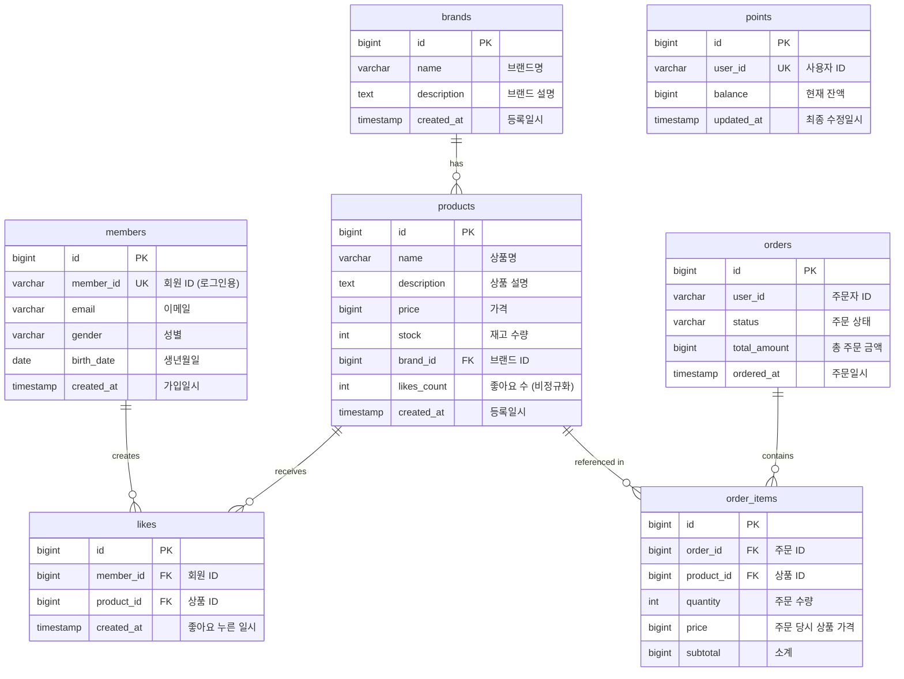

# 04. ERD (Entity Relationship Diagram)

## 개요

이 문서는 감성 이커머스의 데이터베이스 테이블 구조와 관계를 정리합니다.
도메인 모델을 물리적 데이터베이스 스키마로 변환한 설계를 포함합니다.

**설계 범위:**
- 상품/브랜드 테이블
- 좋아요 테이블
- 주문/주문 아이템 테이블
- (회원/포인트는 1주차 완료 - 참고용으로만 포함)

---

## 1. 전체 ERD



**관계 설명:**
- brands : products = 1 : N (한 브랜드는 여러 상품을 가짐)
- products : likes = 1 : N (한 상품은 여러 좋아요를 받음)
- members : likes = 1 : N (한 회원은 여러 좋아요를 생성)
- orders : order_items = 1 : N (한 주문은 여러 주문 아이템을 포함)
- products : order_items = 1 : N (한 상품은 여러 주문에 포함될 수 있음)

---

## 2. 테이블 상세 설계

### 2.1 members (회원) - 1주차 완료

| 컬럼명 | 타입 | 제약조건 | 설명 |
|--------|------|----------|------|
| id | BIGINT | PK, AUTO_INCREMENT | 회원 ID |
| member_id | VARCHAR(50) | NOT NULL, UNIQUE | 사용자 식별자 (로그인 ID) |
| email | VARCHAR(100) | NOT NULL | 이메일 |
| gender | VARCHAR(10) | | 성별 (MALE, FEMALE, OTHER) |
| birth_date | DATE | | 생년월일 |
| created_at | TIMESTAMP | NOT NULL, DEFAULT CURRENT_TIMESTAMP | 가입일시 |

**인덱스:**
- `idx_member_id` ON (member_id) - 사용자 식별용

**비고:**
- 1주차에서 이미 구현됨
- X-USER-ID 헤더로 member_id를 전달받아 회원 식별

---

### 2.2 brands (브랜드)

| 컬럼명 | 타입 | 제약조건 | 설명 |
|--------|------|----------|------|
| id | BIGINT | PK, AUTO_INCREMENT | 브랜드 ID |
| name | VARCHAR(100) | NOT NULL | 브랜드명 |
| description | TEXT | | 브랜드 설명 |
| created_at | TIMESTAMP | NOT NULL, DEFAULT CURRENT_TIMESTAMP | 등록일시 |

**인덱스:**
- `idx_name` ON (name) - 브랜드명 검색용

**비고:**
- 브랜드 데이터는 사전 등록되어 있다고 가정
- 상품 필터링 시 자주 사용되므로 name에 인덱스

**DDL:**
```sql
CREATE TABLE brands (
    id BIGINT AUTO_INCREMENT PRIMARY KEY,
    name VARCHAR(100) NOT NULL,
    description TEXT,
    created_at TIMESTAMP NOT NULL DEFAULT CURRENT_TIMESTAMP,
    INDEX idx_name (name)
) ENGINE=InnoDB DEFAULT CHARSET=utf8mb4;
```

---

### 2.3 products (상품)

| 컬럼명 | 타입 | 제약조건 | 설명 |
|--------|------|----------|------|
| id | BIGINT | PK, AUTO_INCREMENT | 상품 ID |
| name | VARCHAR(200) | NOT NULL | 상품명 |
| description | TEXT | | 상품 설명 |
| price | BIGINT | NOT NULL | 가격 (단위: 원) |
| stock | INT | NOT NULL, DEFAULT 0 | 재고 수량 |
| brand_id | BIGINT | FK, NOT NULL | 브랜드 ID |
| likes_count | INT | NOT NULL, DEFAULT 0 | 좋아요 수 (비정규화) |
| created_at | TIMESTAMP | NOT NULL, DEFAULT CURRENT_TIMESTAMP | 등록일시 |

**인덱스:**
- `idx_brand_id` ON (brand_id) - 브랜드별 필터링
- `idx_created_at` ON (created_at) - 최신순 정렬
- `idx_price` ON (price) - 가격순 정렬 (선택 구현)
- `idx_likes_count` ON (likes_count) - 좋아요순 정렬 (선택 구현)

**외래키:**
- `fk_products_brand` FOREIGN KEY (brand_id) REFERENCES brands(id)

**비고:**
- likes_count는 성능을 위해 비정규화 (COUNT 쿼리 최소화)
- stock은 동시성 제어 필요 (비관적 락 적용)

**DDL:**
```sql
CREATE TABLE products (
    id BIGINT AUTO_INCREMENT PRIMARY KEY,
    name VARCHAR(200) NOT NULL,
    description TEXT,
    price BIGINT NOT NULL,
    stock INT NOT NULL DEFAULT 0,
    brand_id BIGINT NOT NULL,
    likes_count INT NOT NULL DEFAULT 0,
    created_at TIMESTAMP NOT NULL DEFAULT CURRENT_TIMESTAMP,
    INDEX idx_brand_id (brand_id),
    INDEX idx_created_at (created_at),
    INDEX idx_price (price),
    INDEX idx_likes_count (likes_count),
    CONSTRAINT fk_products_brand FOREIGN KEY (brand_id) REFERENCES brands(id)
) ENGINE=InnoDB DEFAULT CHARSET=utf8mb4;
```

---

### 2.4 likes (좋아요)

| 컬럼명 | 타입 | 제약조건 | 설명 |
|--------|------|----------|------|
| id | BIGINT | PK, AUTO_INCREMENT | 좋아요 ID |
| member_id | BIGINT | FK, NOT NULL | 회원 ID |
| product_id | BIGINT | FK, NOT NULL | 상품 ID |
| created_at | TIMESTAMP | NOT NULL, DEFAULT CURRENT_TIMESTAMP | 좋아요 누른 일시 |

**인덱스:**
- `uk_member_product` UNIQUE ON (member_id, product_id) - 중복 방지 (멱등성)
- `idx_product_id` ON (product_id) - 상품별 좋아요 조회
- `idx_member_id` ON (member_id) - 회원별 좋아요 조회

**외래키:**
- `fk_likes_member` FOREIGN KEY (member_id) REFERENCES members(id)
- `fk_likes_product` FOREIGN KEY (product_id) REFERENCES products(id)

**비고:**
- 복합 UNIQUE 인덱스로 멱등성 보장
- 한 사용자는 한 상품에 한 번만 좋아요 가능
- 중복 등록 시도 시 DB에서 제약조건 위반 에러 발생

**DDL:**
```sql
CREATE TABLE likes (
    id BIGINT AUTO_INCREMENT PRIMARY KEY,
    member_id BIGINT NOT NULL,
    product_id BIGINT NOT NULL,
    created_at TIMESTAMP NOT NULL DEFAULT CURRENT_TIMESTAMP,
    UNIQUE INDEX uk_member_product (member_id, product_id),
    INDEX idx_product_id (product_id),
    INDEX idx_member_id (member_id),
    CONSTRAINT fk_likes_member FOREIGN KEY (member_id) REFERENCES members(id),
    CONSTRAINT fk_likes_product FOREIGN KEY (product_id) REFERENCES products(id)
) ENGINE=InnoDB DEFAULT CHARSET=utf8mb4;
```

---

### 2.5 orders (주문)

| 컬럼명 | 타입 | 제약조건 | 설명 |
|--------|------|----------|------|
| id | BIGINT | PK, AUTO_INCREMENT | 주문 ID |
| user_id | VARCHAR(50) | NOT NULL | 주문자 ID |
| status | VARCHAR(20) | NOT NULL | 주문 상태 (PENDING, COMPLETED, FAILED, CANCELLED) |
| total_amount | BIGINT | NOT NULL | 총 주문 금액 |
| ordered_at | TIMESTAMP | NOT NULL, DEFAULT CURRENT_TIMESTAMP | 주문일시 |

**인덱스:**
- `idx_user_id` ON (user_id) - 사용자별 주문 조회
- `idx_status` ON (status) - 상태별 주문 조회
- `idx_ordered_at` ON (ordered_at) - 주문일시 정렬

**비고:**
- status는 ENUM 대신 VARCHAR 사용 (확장성)
- user_id는 members.member_id를 참조하지만 FK는 미설정 (느슨한 결합)
- 주문 상태: PENDING → COMPLETED or FAILED
- CANCELLED는 향후 확장용

**DDL:**
```sql
CREATE TABLE orders (
    id BIGINT AUTO_INCREMENT PRIMARY KEY,
    user_id VARCHAR(50) NOT NULL,
    status VARCHAR(20) NOT NULL,
    total_amount BIGINT NOT NULL,
    ordered_at TIMESTAMP NOT NULL DEFAULT CURRENT_TIMESTAMP,
    INDEX idx_user_id (user_id),
    INDEX idx_status (status),
    INDEX idx_ordered_at (ordered_at)
) ENGINE=InnoDB DEFAULT CHARSET=utf8mb4;
```

---

### 2.6 order_items (주문 아이템)

| 컬럼명 | 타입 | 제약조건 | 설명 |
|--------|------|----------|------|
| id | BIGINT | PK, AUTO_INCREMENT | 주문 아이템 ID |
| order_id | BIGINT | FK, NOT NULL | 주문 ID |
| product_id | BIGINT | FK, NOT NULL | 상품 ID |
| quantity | INT | NOT NULL | 주문 수량 |
| price | BIGINT | NOT NULL | 주문 당시 상품 가격 |
| subtotal | BIGINT | NOT NULL | 소계 (price × quantity) |

**인덱스:**
- `idx_order_id` ON (order_id) - 주문별 아이템 조회
- `idx_product_id` ON (product_id) - 상품별 주문 이력 조회

**외래키:**
- `fk_order_items_order` FOREIGN KEY (order_id) REFERENCES orders(id)
- `fk_order_items_product` FOREIGN KEY (product_id) REFERENCES products(id)

**비고:**
- price는 주문 당시 가격을 저장 (상품 가격 변경과 무관)
- subtotal은 계산값이지만 조회 성능을 위해 저장
- Order의 일부로 관리 (Aggregate)

**DDL:**
```sql
CREATE TABLE order_items (
    id BIGINT AUTO_INCREMENT PRIMARY KEY,
    order_id BIGINT NOT NULL,
    product_id BIGINT NOT NULL,
    quantity INT NOT NULL,
    price BIGINT NOT NULL,
    subtotal BIGINT NOT NULL,
    INDEX idx_order_id (order_id),
    INDEX idx_product_id (product_id),
    CONSTRAINT fk_order_items_order FOREIGN KEY (order_id) REFERENCES orders(id),
    CONSTRAINT fk_order_items_product FOREIGN KEY (product_id) REFERENCES products(id)
) ENGINE=InnoDB DEFAULT CHARSET=utf8mb4;
```

---

### 2.7 points (포인트) - 1주차 완료

| 컬럼명 | 타입 | 제약조건 | 설명 |
|--------|------|----------|------|
| id | BIGINT | PK, AUTO_INCREMENT | 포인트 ID |
| user_id | VARCHAR(50) | NOT NULL, UNIQUE | 사용자 ID |
| balance | BIGINT | NOT NULL, DEFAULT 0 | 현재 잔액 |
| updated_at | TIMESTAMP | NOT NULL, DEFAULT CURRENT_TIMESTAMP ON UPDATE CURRENT_TIMESTAMP | 최종 수정일시 |

**인덱스:**
- `uk_user_id` UNIQUE ON (user_id) - 사용자별 포인트 유일성

**비고:**
- 1주차에서 이미 구현됨
- 동시성 제어 필요 (비관적 락)
- 한 사용자당 하나의 포인트 레코드

---

## 3. 주요 제약조건 및 인덱스 전략

### 3.1 중복 방지
- **likes 테이블**: `UNIQUE INDEX (member_id, product_id)` → 멱등성 보장
- **points 테이블**: `UNIQUE INDEX (user_id)` → 사용자당 하나의 포인트

### 3.2 조회 성능 최적화

**products 테이블:**
- `idx_brand_id`: 브랜드별 필터링 (`WHERE brand_id = ?`)
- `idx_created_at`: 최신순 정렬 (`ORDER BY created_at DESC`)
- `idx_price`: 가격순 정렬 (`ORDER BY price ASC`) - 선택 구현
- `idx_likes_count`: 좋아요순 정렬 (`ORDER BY likes_count DESC`) - 선택 구현

**orders 테이블:**
- `idx_user_id`: 사용자별 주문 조회 (`WHERE user_id = ?`)
- `idx_ordered_at`: 주문일시 정렬 (`ORDER BY ordered_at DESC`)

**likes 테이블:**
- `idx_member_id`: 내가 좋아요한 상품 목록 (`WHERE member_id = ?`)
- `idx_product_id`: 상품별 좋아요 조회 (`WHERE product_id = ?`)

### 3.3 참조 무결성
- 외래키 설정으로 데이터 정합성 보장
- CASCADE 옵션은 신중하게 사용 (기본적으로 RESTRICT)
- orders.user_id는 FK 미설정 (느슨한 결합, 확장성)

### 3.4 동시성 제어
- **products.stock**: 재고 차감 시 비관적 락 (`SELECT ... FOR UPDATE`)
- **points.balance**: 포인트 차감 시 비관적 락 (`SELECT ... FOR UPDATE`)

```sql
-- 재고 차감 시 비관적 락
SELECT * FROM products WHERE id = ? FOR UPDATE;
UPDATE products SET stock = stock - ? WHERE id = ?;

-- 포인트 차감 시 비관적 락
SELECT * FROM points WHERE user_id = ? FOR UPDATE;
UPDATE points SET balance = balance - ? WHERE user_id = ?;
```

---

## 4. 데이터 타입 선택 근거

### 4.1 BIGINT vs INT
- **BIGINT**: id, price, total_amount, balance → 큰 범위 필요
- **INT**: stock, quantity, likes_count → 충분한 범위

### 4.2 VARCHAR vs TEXT
- **VARCHAR(n)**: 길이 제한이 있는 값 (name, email, status)
- **TEXT**: 긴 텍스트 (description)

### 4.3 TIMESTAMP
- 모든 일시 정보는 `TIMESTAMP` 사용
- 자동 업데이트가 필요한 경우 `ON UPDATE CURRENT_TIMESTAMP` 활용

---

## 5. 정규화 vs 비정규화

### 5.1 비정규화 사례

**products.likes_count**
- **정규화**: likes 테이블에서 COUNT 쿼리
  ```sql
  SELECT COUNT(*) FROM likes WHERE product_id = ?;
  ```
- **비정규화**: products 테이블에 likes_count 컬럼 추가
- **이유**: 상품 목록 조회 시 성능 최적화 (N+1 쿼리 방지)
- **트레이드오프**: 좋아요 등록/취소 시 UPDATE 쿼리 추가

**order_items.price & subtotal**
- 현재 상품 가격과 무관하게 주문 당시 가격 저장
- **이유**: 과거 주문 정보의 정확성 보장
- subtotal은 계산값이지만 조회 성능을 위해 저장

### 5.2 정규화 유지

**brands, products, orders**
- 기본적인 정규화 유지
- 중복 데이터 최소화
- 일관성 유지

---

## 6. 샘플 데이터

### 6.1 brands
```sql
INSERT INTO brands (name, description, created_at) VALUES
('감성브랜드', '감성을 담은 브랜드입니다. 일상의 특별함을 전합니다.', NOW()),
('모던브랜드', '모던한 디자인의 브랜드입니다. 심플함의 완성.', NOW()),
('빈티지브랜드', '빈티지 감성의 브랜드입니다. 추억을 담다.', NOW());
```

### 6.2 products
```sql
INSERT INTO products (name, description, price, stock, brand_id, likes_count, created_at) VALUES
('감성 티셔츠', '편안한 착용감의 감성 티셔츠입니다. 데일리룩으로 완벽해요.', 29000, 100, 1, 0, NOW()),
('감성 후드', '따뜻한 감성 후드입니다. 가을/겨울 필수 아이템.', 49000, 50, 1, 0, NOW()),
('모던 셔츠', '심플한 모던 셔츠입니다. 어디든 잘 어울려요.', 39000, 80, 2, 0, NOW()),
('빈티지 청바지', '빈티지 감성의 청바지입니다. 세월의 멋.', 59000, 30, 3, 0, NOW()),
('감성 맨투맨', '부드러운 감성 맨투맨입니다. 편안함의 극치.', 35000, 60, 1, 0, NOW());
```

### 6.3 members (1주차 완료)
```sql
INSERT INTO members (member_id, email, gender, birth_date, created_at) VALUES
('user001', 'user001@example.com', 'MALE', '1990-01-15', NOW()),
('user002', 'user002@example.com', 'FEMALE', '1992-05-20', NOW()),
('user003', 'user003@example.com', 'MALE', '1988-11-03', NOW());
```

### 6.4 points (1주차 완료)
```sql
INSERT INTO points (user_id, balance, updated_at) VALUES
('user001', 100000, NOW()),
('user002', 150000, NOW()),
('user003', 200000, NOW());
```

---

## 7. 주요 쿼리 예시

### 7.1 상품 목록 조회 (브랜드 필터링 + 최신순)
```sql
SELECT 
    p.id,
    p.name,
    p.price,
    p.stock,
    p.brand_id,
    b.name AS brand_name,
    p.likes_count,
    p.created_at
FROM products p
JOIN brands b ON p.brand_id = b.id
WHERE p.brand_id = ?
ORDER BY p.created_at DESC
LIMIT ? OFFSET ?;
```

### 7.2 상품 목록 조회 (좋아요순)
```sql
SELECT 
    p.id,
    p.name,
    p.price,
    p.stock,
    p.brand_id,
    b.name AS brand_name,
    p.likes_count,
    p.created_at
FROM products p
JOIN brands b ON p.brand_id = b.id
ORDER BY p.likes_count DESC, p.created_at DESC
LIMIT ? OFFSET ?;
```

### 7.3 좋아요 중복 확인 (멱등성)
```sql
SELECT EXISTS(
    SELECT 1 FROM likes 
    WHERE member_id = ? AND product_id = ?
) AS is_liked;
```

### 7.4 내가 좋아요한 상품 목록
```sql
SELECT 
    p.id,
    p.name,
    p.price,
    b.name AS brand_name,
    p.likes_count,
    l.created_at AS liked_at
FROM likes l
JOIN products p ON l.product_id = p.id
JOIN brands b ON p.brand_id = b.id
WHERE l.member_id = ?
ORDER BY l.created_at DESC
LIMIT ? OFFSET ?;
```

### 7.5 주문 생성 시 재고 확인 및 차감 (동시성 제어)
```sql
-- 1. 재고 확인 (비관적 락)
SELECT id, stock FROM products WHERE id = ? FOR UPDATE;

-- 2. 재고 차감
UPDATE products 
SET stock = stock - ?,
    likes_count = likes_count  -- 버전 관리 없이 직접 차감
WHERE id = ? AND stock >= ?;

-- 3. 영향받은 행 수 확인
-- affected rows = 0 이면 재고 부족
```

### 7.6 포인트 차감 (동시성 제어)
```sql
-- 1. 포인트 확인 (비관적 락)
SELECT id, balance FROM points WHERE user_id = ? FOR UPDATE;

-- 2. 포인트 차감
UPDATE points 
SET balance = balance - ?,
    updated_at = CURRENT_TIMESTAMP
WHERE user_id = ? AND balance >= ?;

-- 3. 영향받은 행 수 확인
-- affected rows = 0 이면 포인트 부족
```

### 7.7 주문 상세 조회
```sql
SELECT 
    o.id AS order_id,
    o.user_id,
    o.status,
    o.total_amount,
    o.ordered_at,
    oi.id AS item_id,
    oi.product_id,
    p.name AS product_name,
    oi.quantity,
    oi.price,
    oi.subtotal
FROM orders o
JOIN order_items oi ON o.id = oi.order_id
JOIN products p ON oi.product_id = p.id
WHERE o.id = ?;
```

---

## 8. 마이그레이션 고려사항

### 8.1 테이블 생성 순서
1. members (1주차 완료)
2. points (1주차 완료)
3. **brands** ← 새로 추가
4. **products** ← 새로 추가 (brands 참조)
5. **likes** ← 새로 추가 (members, products 참조)
6. **orders** ← 새로 추가
7. **order_items** ← 새로 추가 (orders, products 참조)

### 8.2 인덱스 추가 시점
- **초기**: PK, FK, UNIQUE 인덱스만 생성
- **성능 테스트 후**: 조회 성능 개선을 위한 인덱스 추가
- **모니터링**: Slow Query Log 분석 후 필요한 인덱스 추가

### 8.3 Flyway 마이그레이션 예시

**V2_1__create_brands_table.sql**
```sql
CREATE TABLE brands (
    id BIGINT AUTO_INCREMENT PRIMARY KEY,
    name VARCHAR(100) NOT NULL,
    description TEXT,
    created_at TIMESTAMP NOT NULL DEFAULT CURRENT_TIMESTAMP,
    INDEX idx_name (name)
) ENGINE=InnoDB DEFAULT CHARSET=utf8mb4;
```

**V2_2__create_products_table.sql**
```sql
CREATE TABLE products (
    id BIGINT AUTO_INCREMENT PRIMARY KEY,
    name VARCHAR(200) NOT NULL,
    description TEXT,
    price BIGINT NOT NULL,
    stock INT NOT NULL DEFAULT 0,
    brand_id BIGINT NOT NULL,
    likes_count INT NOT NULL DEFAULT 0,
    created_at TIMESTAMP NOT NULL DEFAULT CURRENT_TIMESTAMP,
    INDEX idx_brand_id (brand_id),
    INDEX idx_created_at (created_at),
    INDEX idx_price (price),
    INDEX idx_likes_count (likes_count),
    CONSTRAINT fk_products_brand FOREIGN KEY (brand_id) REFERENCES brands(id)
) ENGINE=InnoDB DEFAULT CHARSET=utf8mb4;
```

**V2_3__create_likes_table.sql**
```sql
CREATE TABLE likes (
    id BIGINT AUTO_INCREMENT PRIMARY KEY,
    member_id BIGINT NOT NULL,
    product_id BIGINT NOT NULL,
    created_at TIMESTAMP NOT NULL DEFAULT CURRENT_TIMESTAMP,
    UNIQUE INDEX uk_member_product (member_id, product_id),
    INDEX idx_product_id (product_id),
    INDEX idx_member_id (member_id),
    CONSTRAINT fk_likes_member FOREIGN KEY (member_id) REFERENCES members(id),
    CONSTRAINT fk_likes_product FOREIGN KEY (product_id) REFERENCES products(id)
) ENGINE=InnoDB DEFAULT CHARSET=utf8mb4;
```

**V2_4__create_orders_and_order_items_tables.sql**
```sql
CREATE TABLE orders (
    id BIGINT AUTO_INCREMENT PRIMARY KEY,
    user_id VARCHAR(50) NOT NULL,
    status VARCHAR(20) NOT NULL,
    total_amount BIGINT NOT NULL,
    ordered_at TIMESTAMP NOT NULL DEFAULT CURRENT_TIMESTAMP,
    INDEX idx_user_id (user_id),
    INDEX idx_status (status),
    INDEX idx_ordered_at (ordered_at)
) ENGINE=InnoDB DEFAULT CHARSET=utf8mb4;

CREATE TABLE order_items (
    id BIGINT AUTO_INCREMENT PRIMARY KEY,
    order_id BIGINT NOT NULL,
    product_id BIGINT NOT NULL,
    quantity INT NOT NULL,
    price BIGINT NOT NULL,
    subtotal BIGINT NOT NULL,
    INDEX idx_order_id (order_id),
    INDEX idx_product_id (product_id),
    CONSTRAINT fk_order_items_order FOREIGN KEY (order_id) REFERENCES orders(id),
    CONSTRAINT fk_order_items_product FOREIGN KEY (product_id) REFERENCES products(id)
) ENGINE=InnoDB DEFAULT CHARSET=utf8mb4;
```

**V2_5__insert_sample_data.sql**
```sql
-- 브랜드 샘플 데이터
INSERT INTO brands (name, description) VALUES
('감성브랜드', '감성을 담은 브랜드입니다.'),
('모던브랜드', '모던한 디자인의 브랜드입니다.'),
('빈티지브랜드', '빈티지 감성의 브랜드입니다.');

-- 상품 샘플 데이터
INSERT INTO products (name, description, price, stock, brand_id, likes_count) VALUES
('감성 티셔츠', '편안한 착용감의 감성 티셔츠', 29000, 100, 1, 0),
('감성 후드', '따뜻한 감성 후드', 49000, 50, 1, 0),
('모던 셔츠', '심플한 모던 셔츠', 39000, 80, 2, 0),
('빈티지 청바지', '빈티지 감성의 청바지', 59000, 30, 3, 0),
('감성 맨투맨', '부드러운 감성 맨투맨', 35000, 60, 1, 0);
```

---

## 9. 성능 최적화 전략

### 9.1 인덱스 활용
- 브랜드 필터링: `idx_brand_id`
- 정렬: `idx_created_at`, `idx_price`, `idx_likes_count`
- 좋아요 조회: `uk_member_product`, `idx_member_id`, `idx_product_id`

### 9.2 비정규화
- `products.likes_count`: COUNT 쿼리 대신 컬럼 저장
- `order_items.subtotal`: 계산값을 컬럼으로 저장

### 9.3 동시성 제어
- 비관적 락 (`SELECT FOR UPDATE`)으로 재고/포인트 정합성 보장
- 트랜잭션 격리 수준: READ COMMITTED (기본)

### 9.4 페이지네이션
- LIMIT/OFFSET 대신 커서 기반 페이지네이션 고려 (대용량 데이터)
- 초기에는 LIMIT/OFFSET으로 구현 후 필요시 개선

---

## 10. 모니터링 및 유지보수

### 10.1 슬로우 쿼리 로깅
```sql
SET GLOBAL slow_query_log = 'ON';
SET GLOBAL long_query_time = 1; -- 1초 이상 쿼리 로깅
```

### 10.2 인덱스 사용 분석
```sql
EXPLAIN SELECT ... FROM products WHERE brand_id = ? ORDER BY created_at DESC;
```

### 10.3 테이블 크기 모니터링
```sql
SELECT 
    table_name,
    table_rows,
    ROUND((data_length + index_length) / 1024 / 1024, 2) AS size_mb
FROM information_schema.tables
WHERE table_schema = 'commerce_db'
ORDER BY (data_length + index_length) DESC;
```

---

## 11. 다음 단계

이 ERD 설계를 기반으로:
1. **Flyway 마이그레이션 스크립트 작성**
2. **JPA Entity 매핑** (Kotlin 코드)
3. **Repository 구현** (Spring Data JPA)
4. **통합 테스트** (Testcontainers + MySQL)
5. **성능 테스트** (동시성, 대용량 데이터)


