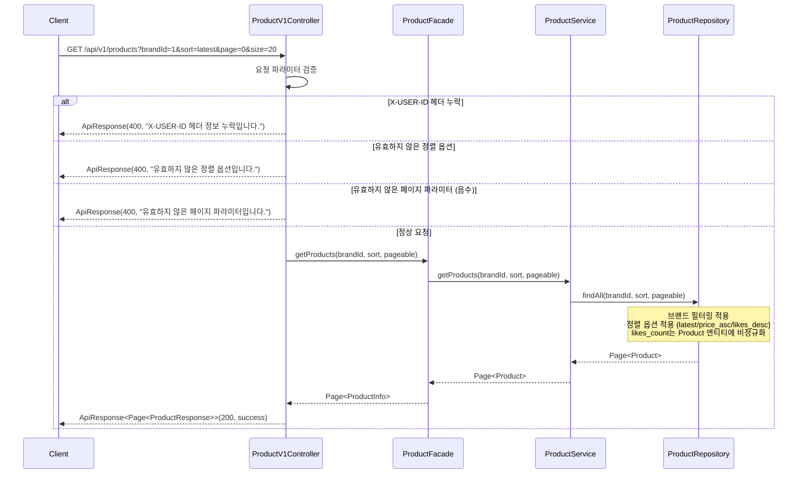
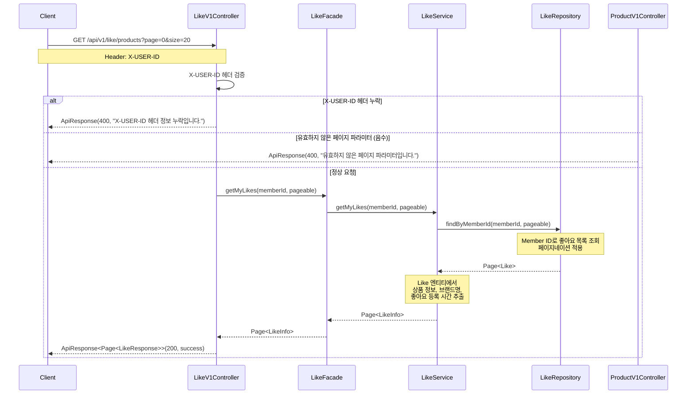
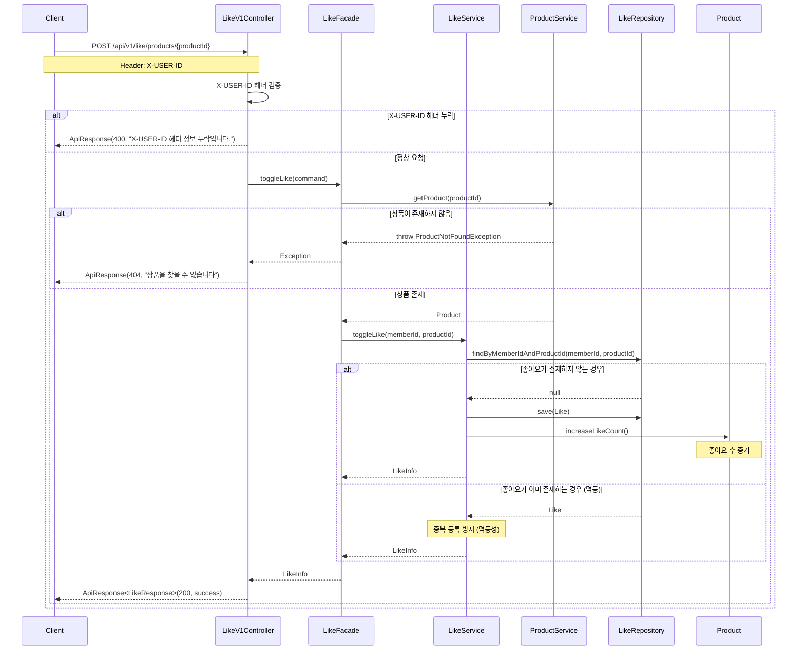
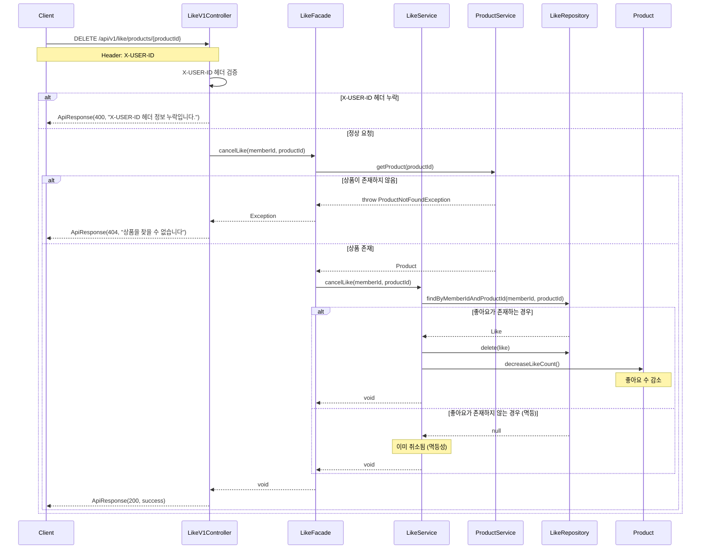

# 02. 시퀀스 다이어그램

## 1. 상품 목록 조회 (필터링 및 정렬)

### 시나리오
사용자가 브랜드 필터링과 정렬 옵션을 적용하여 상품 목록을 조회합니다.

---

## 2. 내가 좋아요한 상품 목록 조회

### 시나리오
사용자가 자신이 좋아요한 상품 목록을 조회합니다.

---

## 3. 상품 좋아요 등록 (멱등 동작)

### 시나리오
사용자가 상품에 좋아요를 등록하는 흐름입니다.
멱등성을 보장하여 같은 요청이 여러 번 와도 동일한 결과를 반환합니다.

---

## 4. 상품 좋아요 취소 (멱등 동작)

---

