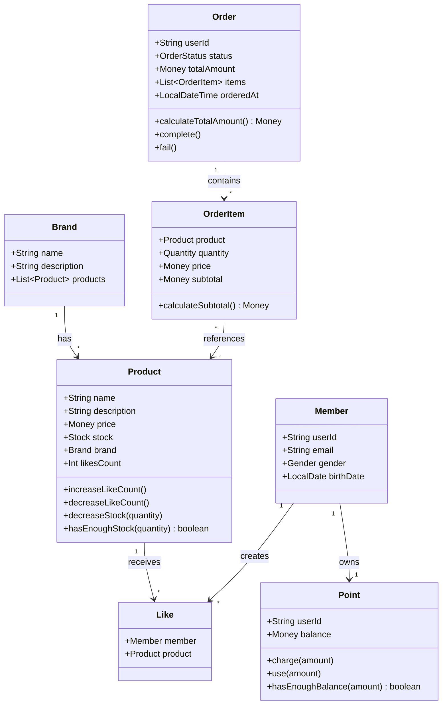

# 03. 클래스 다이어그램

## 1. 도메인 모델 전체 구조

> **참고**: 모든 엔티티는 `BaseEntity`를 상속받아 `id`, `createdAt`, `updatedAt`, `deletedAt` 필드를 가집니다.

---

## 2. 도메인 객체별 상세 설계

### 2.1 Product (상품)

**책임:**
- 상품 정보 관리
- 재고 차감 및 검증
- 좋아요 수 증감
---

### 2.2 Order (주문)

**책임:**
- 주문 정보 관리
- 총 금액 계산
- 주문 상태 변경
---

### 2.3 Like (좋아요)

**책임:**
- 사용자-상품 간 좋아요 관계 표현
- 중복 방지 (복합키)
---

### 2.4 Brand (브랜드)

**책임:**
- 브랜드 정보 관리
- 상품 목록 관리
---

## 3. Value Object (VO) 설계

### 3.1 Money (금액)

**책임:**
- 금액을 표현하고 검증
- 금액 연산 (더하기, 빼기, 곱하기)
- 금액 비교 연산

**주요 속성:**
- `amount: Long` - 금액 (단위: 원)

**주요 메서드:**
- `plus(other: Money): Money` - 금액 더하기
- `minus(other: Money): Money` - 금액 빼기
- `multiply(quantity: Int): Money` - 금액 곱하기
- `isGreaterThanOrEqual(other: Money): Boolean` - 금액 비교
- `validate()` - 금액 검증 (0 이상)

**특징:**
- 불변 객체 (Immutable)
- 연산 시 새로운 Money 객체 생성
- 음수 금액 방지

---

### 3.2 Stock (재고)

**책임:**
- 재고 수량 표현 및 검증
- 재고 차감 및 검증
- 재고 부족 여부 확인

**주요 속성:**
- `quantity: Int` - 재고 수량

**주요 메서드:**
- `decrease(amount: Int): Stock` - 재고 차감
- `increase(amount: Int): Stock` - 재고 증가
- `hasEnough(required: Int): Boolean` - 충분한 재고 확인
- `validate()` - 재고 검증 (0 이상)

**특징:**
- 불변 객체 (Immutable)
- 재고 부족 시 예외 발생
- 음수 재고 방지

---

### 3.3 Quantity (수량)

**책임:**
- 주문 수량 표현 및 검증
- 수량 유효성 검증

**주요 속성:**
- `value: Int` - 수량

**주요 메서드:**
- `validate()` - 수량 검증 (1 이상)

**특징:**
- 불변 객체 (Immutable)
- 0 이하 수량 방지
- 주문 시 최소 수량 1개 보장

---

### 3.4 MemberId (회원 ID) - 기존 구현

**책임:**
- 회원 식별자 표현 및 검증
- 형식 검증 (영문/숫자 10자 이내)

**주요 속성:**
- `value: String` - 회원 ID

**특징:**
- `@Embeddable` 사용
- 영문 또는 숫자만 허용
- 최대 10자 제한
- 빈 문자열 불허

---

### 3.5 BirthDate (생년월일) - 기존 구현

**책임:**
- 생년월일 표현 및 검증
- 날짜 형식 검증

**주요 속성:**
- `value: LocalDate` - 생년월일

**주요 메서드:**
- `from(value: String): BirthDate` - 문자열로부터 생성

**특징:**
- `@Embeddable` 사용
- 날짜 형식 검증
- 잘못된 형식 시 예외 발생

---

### 3.6 Point (포인트) - 기존 구현

**책임:**
- 포인트 금액 표현 및 검증
- 음수 방지

**주요 속성:**
- `amount: Long` - 포인트 금액

**특징:**
- `@Embeddable` 사용
- 0 이상만 허용
- 음수 포인트 방지

---

### 3.7 Gender (성별) - 기존 구현

**책임:**
- 성별 표현

**값:**
- `MALE` - 남성
- `FEMALE` - 여성

**특징:**
- Enum 타입
- 제한된 값만 허용

---

### 3.8 OrderStatus (주문 상태)

**책임:**
- 주문 상태 표현
- 주문 처리 단계 추적

**값:**
- `PENDING` - 주문 대기 (결제 진행 중)
- `COMPLETED` - 주문 완료 (외부 시스템 연동 성공)
- `FAILED` - 주문 실패 (외부 시스템 연동 실패, 롤백 완료)
- `CANCELLED` - 주문 취소

**특징:**
- Enum 타입
- 주문 생명주기를 명확히 표현
- 외부 시스템 연동 결과 반영

**상태 전이:**
- PENDING → COMPLETED (정상 완료)
- PENDING → FAILED (외부 시스템 실패)
- COMPLETED → CANCELLED (취소 요청 시)

---