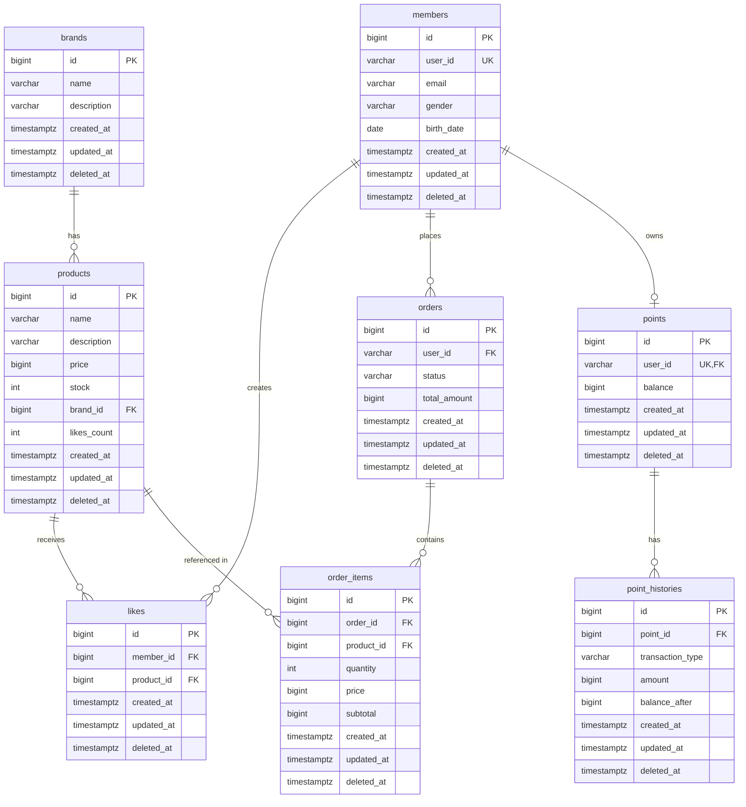

# 04. ERD (Entity Relationship Diagram)

## 1. 전체 ERD

---

## 2. 테이블별 상세 설계

### 2.1 members (회원)

| 컬럼명 | 타입 | 제약조건 | 설명 |
|--------|------|----------|------|
| id | BIGINT | PK, AUTO_INCREMENT | 회원 ID |
| user_id | VARCHAR(50) | NOT NULL, UNIQUE | 사용자 식별자 (로그인 ID) |
| email | VARCHAR(100) | NOT NULL | 이메일 |
| gender | VARCHAR(10) | | 성별 (MALE, FEMALE, OTHER) |
| birth_date | DATE | | 생년월일 |
| created_at | TIMESTAMPTZ | NOT NULL | 가입일시 |
| updated_at | TIMESTAMPTZ | NOT NULL | 수정일시 |
| deleted_at | TIMESTAMPTZ | NULL | 삭제일시 (Soft Delete) |

---

### 2.2 brands (브랜드)

| 컬럼명 | 타입 | 제약조건 | 설명 |
|--------|------|----------|------|
| id | BIGINT | PK, AUTO_INCREMENT | 브랜드 ID |
| name | VARCHAR(100) | NOT NULL | 브랜드명 |
| description | TEXT | | 브랜드 설명 |
| created_at | TIMESTAMPTZ | NOT NULL | 등록일시 |
| updated_at | TIMESTAMPTZ | NOT NULL | 수정일시 |
| deleted_at | TIMESTAMPTZ | NULL | 삭제일시 (Soft Delete) |

---

### 2.3 products (상품)

| 컬럼명 | 타입 | 제약조건 | 설명 |
|--------|------|----------|------|
| id | BIGINT | PK, AUTO_INCREMENT | 상품 ID |
| name | VARCHAR(200) | NOT NULL | 상품명 |
| description | TEXT | | 상품 설명 |
| price | BIGINT | NOT NULL | 가격 (단위: 원) |
| stock | INT | NOT NULL, DEFAULT 0 | 재고 수량 |
| brand_id | BIGINT | FK, NOT NULL | 브랜드 ID |
| likes_count | INT | NOT NULL, DEFAULT 0 | 좋아요 수 (비정규화) |
| created_at | TIMESTAMPTZ | NOT NULL | 등록일시 |
| updated_at | TIMESTAMPTZ | NOT NULL | 수정일시 |
| deleted_at | TIMESTAMPTZ | NULL | 삭제일시 (Soft Delete) |

**비고:**
- likes_count는 성능을 위해 비정규화 (COUNT 쿼리 최소화)
- stock은 동시성 제어 필요 (비관적 락 or 낙관적 락)

---

### 2.4 likes (좋아요)

| 컬럼명 | 타입 | 제약조건 | 설명 |
|--------|------|----------|------|
| id | BIGINT | PK, AUTO_INCREMENT | 좋아요 ID |
| member_id | BIGINT | FK, NOT NULL | 회원 ID |
| product_id | BIGINT | FK, NOT NULL | 상품 ID |
| created_at | TIMESTAMPTZ | NOT NULL | 좋아요 누른 일시 |
| updated_at | TIMESTAMPTZ | NOT NULL | 수정일시 |
| deleted_at | TIMESTAMPTZ | NULL | 삭제일시 (Soft Delete) |

**비고:**
- 복합 UNIQUE 인덱스로 멱등성 보장
- 한 사용자는 한 상품에 한 번만 좋아요 가능

---

### 2.5 orders (주문)

| 컬럼명 | 타입 | 제약조건 | 설명 |
|--------|------|----------|------|
| id | BIGINT | PK, AUTO_INCREMENT | 주문 ID |
| user_id | VARCHAR(50) | NOT NULL | 주문자 ID |
| status | VARCHAR(20) | NOT NULL | 주문 상태 (PENDING, COMPLETED, FAILED, CANCELLED) |
| total_amount | BIGINT | NOT NULL | 총 주문 금액 |
| created_at | TIMESTAMPTZ | NOT NULL | 주문일시 |
| updated_at | TIMESTAMPTZ | NOT NULL | 수정일시 |
| deleted_at | TIMESTAMPTZ | NULL | 삭제일시 (Soft Delete) |

---

### 2.6 order_items (주문 아이템)

| 컬럼명 | 타입 | 제약조건 | 설명 |
|--------|------|----------|------|
| id | BIGINT | PK, AUTO_INCREMENT | 주문 아이템 ID |
| order_id | BIGINT | FK, NOT NULL | 주문 ID |
| product_id | BIGINT | FK, NOT NULL | 상품 ID |
| quantity | INT | NOT NULL | 주문 수량 |
| price | BIGINT | NOT NULL | 주문 당시 상품 가격 |
| subtotal | BIGINT | NOT NULL | 소계 (price * quantity) |
| created_at | TIMESTAMPTZ | NOT NULL | 생성일시 |
| updated_at | TIMESTAMPTZ | NOT NULL | 수정일시 |
| deleted_at | TIMESTAMPTZ | NULL | 삭제일시 (Soft Delete) |

**비고:**
- price는 주문 당시 가격을 저장 (상품 가격 변경과 무관)
- subtotal은 계산값이지만 조회 성능을 위해 저장

---

### 2.7 points (포인트)

| 컬럼명 | 타입 | 제약조건 | 설명 |
|--------|------|----------|------|
| id | BIGINT | PK, AUTO_INCREMENT | 포인트 ID |
| user_id | VARCHAR(50) | NOT NULL, UNIQUE | 사용자 ID |
| balance | BIGINT | NOT NULL, DEFAULT 0 | 현재 잔액 |
| created_at | TIMESTAMPTZ | NOT NULL | 포인트 계정 생성일시 |
| updated_at | TIMESTAMPTZ | NOT NULL | 최종 잔액 변경일시 |
| deleted_at | TIMESTAMPTZ | NULL | 삭제일시 (Soft Delete) |

**비고:**
- 동시성 제어 필요 (비관적 락)
- 한 사용자당 하나의 포인트 레코드

---

### 2.8 point_histories (포인트 이력)

| 컬럼명 | 타입 | 제약조건 | 설명 |
|--------|------|----------|------|
| id | BIGINT | PK, AUTO_INCREMENT | 이력 ID |
| point_id | BIGINT | FK, NOT NULL | 포인트 ID |
| transaction_type | VARCHAR(20) | NOT NULL | 거래 유형 (CHARGE, USE, REFUND) |
| amount | BIGINT | NOT NULL | 거래 금액 |
| balance_after | BIGINT | NOT NULL | 거래 후 잔액 |
| created_at | TIMESTAMPTZ | NOT NULL | 거래일시 |
| updated_at | TIMESTAMPTZ | NOT NULL | 수정일시 |
| deleted_at | TIMESTAMPTZ | NULL | 삭제일시 (Soft Delete) |

**비고:**
- 포인트 변동 이력을 추적하기 위한 감사 테이블
- balance_after로 특정 시점의 잔액 확인 가능

---