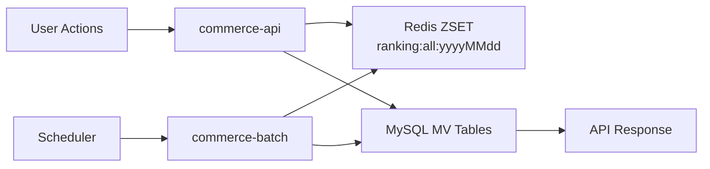
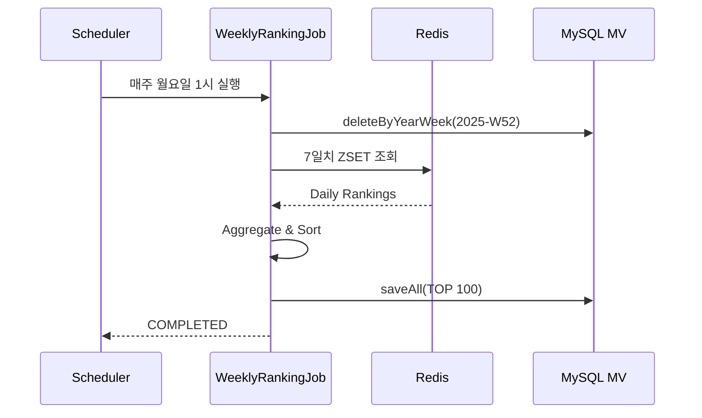

# Pull Request 작성 가이드 (Round 10 기준)

> 참고: [volume-8 Kafka Decoupling PR #191](https://github.com/Loopers-dev-lab/loopers-spring-java-template/pull/191)

---

## PR 제목 형식

```
[round-10] Spring Batch로 주간/월간 랭킹 시스템 구축
```

또는

```
[round-10] Weekly/Monthly Ranking System with Spring Batch
```

---

## PR 본문 구조

### 📌 Summary

**구현 목적과 핵심 내용을 3-5문장으로 요약**

```markdown
## 📌 Summary

이 PR은 **Spring Batch**와 **Materialized View** 패턴을 사용하여 주간/월간 랭킹 시스템을 구현합니다.

- **Batch Job**: Redis ZSET 데이터를 7일/30일 단위로 집계하여 Materialized View 테이블에 저장
- **Materialized View**: `mv_product_rank_weekly`, `mv_product_rank_monthly` 테이블로 TOP 100 랭킹 사전 계산
- **API 확장**: 기존 일간 랭킹 API에 `period` 파라미터 추가 (daily/weekly/monthly 지원)
- **스케줄링**: 매주 월요일 1시, 매월 1일 2시 자동 실행
- **성능 최적화**: O(N) Redis 조회를 O(1) MySQL 조회로 개선
```

---

### 💬 Review Points

**기술적 의사결정 및 Trade-off에 대한 상세 설명 (3-5개 주요 포인트)**

각 포인트는 다음 구조로 작성:
1. **배경/문제 상황**
2. **선택한 해결 방법**
3. **구현 세부사항 (코드 참조 포함)**
4. **고려사항/Trade-off**

#### 템플릿:

```markdown
## 💬 Review Points

### 1️⃣ Materialized View vs Real-time Aggregation

**🎯 배경**
- Redis에서 7일치 ZSET을 매 요청마다 집계하면 O(7N) 시간 복잡도
- 주간 TOP 100 조회는 데이터 변경이 적고 읽기가 많은 전형적인 Read-heavy 패턴
- 실시간성보다는 정확성과 성능이 중요한 요구사항

**✅ 해결 방법**
Materialized View 패턴을 도입하여 배치 시점에 집계 결과를 MySQL에 사전 저장

**📝 구현 세부사항**

1. **MV 테이블 설계** (`docker/01-schema.sql`)
```sql
CREATE TABLE IF NOT EXISTS mv_product_rank_weekly (
    id BIGINT AUTO_INCREMENT PRIMARY KEY,
    product_id BIGINT NOT NULL,
    year_week VARCHAR(10) NOT NULL,
    score DOUBLE NOT NULL,
    rank_position INT NOT NULL,
    created_at TIMESTAMP DEFAULT CURRENT_TIMESTAMP,
    updated_at TIMESTAMP DEFAULT CURRENT_TIMESTAMP ON UPDATE CURRENT_TIMESTAMP,
    INDEX idx_year_week (year_week),
    INDEX idx_product_id (product_id),
    UNIQUE KEY uk_product_week (product_id, year_week)
);
```

2. **Batch Job에서 MV 갱신** (`WeeklyRankingJobConfig.kt:45-67`)
```kotlin
private fun aggregateWeeklyScores(yearWeek: String): List<Pair<Long, Double>> {
    val weekDates = DateUtils.getWeekDates(yearWeek)
    val aggregatedScores = mutableMapOf<Long, Double>()

    weekDates.forEach { date ->
        val key = "ranking:all:${DateUtils.formatDate(date)}"
        val dailyRankings = redisTemplate.opsForZSet()
            .reverseRangeWithScores(key, 0, -1) ?: emptySet()

        dailyRankings.forEach { entry ->
            val productId = entry.value?.toLongOrNull() ?: return@forEach
            val score = entry.score ?: 0.0
            aggregatedScores[productId] = aggregatedScores.getOrDefault(productId, 0.0) + score
        }
    }

    return aggregatedScores.entries
        .sortedByDescending { it.value }
        .take(100)
        .map { it.key to it.value }
}
```

3. **API에서 MV 조회** (`RankingFacade.kt:89-102`)
```kotlin
fun getWeeklyRankings(yearWeek: String, pageable: Pageable): Page<RankingInfo> {
    val rankings = mvWeeklyRepository.findByYearWeekOrderByRankPositionAsc(yearWeek)

    val start = pageable.offset.toInt()
    val end = min(start + pageable.pageSize, rankings.size)

    val pageContent = rankings.subList(start, end).map { mv ->
        val product = productService.getProductById(mv.productId)
        RankingInfo(
            rank = mv.rankPosition,
            product = product,
            score = mv.score
        )
    }

    return PageImpl(pageContent, pageable, rankings.size.toLong())
}
```

**⚠️ 고려사항**
- MV 데이터는 배치 실행 시점까지의 데이터만 반영 (최대 1주일 지연 가능)
- 스토리지 오버헤드: 주차별 TOP 100 × 52주 ≈ 5,200개 레코드/년
- 과거 주차 데이터 정리 정책 필요 (예: 1년 이상 된 데이터 아카이빙)
- 배치 실패 시 해당 주차/월 데이터 누락 가능성 → 모니터링 필수

---

### 2️⃣ Tasklet vs Chunk-oriented Processing

**🎯 배경**
- Spring Batch는 크게 Tasklet 방식과 Chunk 방식 제공
- Chunk는 대용량 데이터 처리에 유리하지만, 랭킹 집계는 로직이 단순하고 데이터가 제한적 (TOP 100)

**✅ 해결 방법**
Tasklet 기반 단순 처리 선택

**📝 구현 세부사항**

`WeeklyRankingJobConfig.kt:25-38`
```kotlin
@Bean
fun weeklyRankingJob(): Job {
    return jobBuilderFactory.get("weeklyRankingJob")
        .start(weeklyRankingStep())
        .build()
}

@Bean
fun weeklyRankingStep(): Step {
    return stepBuilderFactory.get("weeklyRankingStep")
        .tasklet(weeklyRankingTasklet())
        .build()
}

@Bean
@StepScope
fun weeklyRankingTasklet(
    @Value("#{jobParameters['yearWeek']}") yearWeek: String
): Tasklet {
    return Tasklet { contribution, chunkContext ->
        logger.info("Starting weekly ranking aggregation for $yearWeek")

        // 1. 기존 데이터 삭제 (멱등성 보장)
        mvWeeklyRepository.deleteByYearWeek(yearWeek)

        // 2. Redis 집계
        val rankings = aggregateWeeklyScores(yearWeek)

        // 3. MV 저장
        val entities = rankings.mapIndexed { index, (productId, score) ->
            MaterializedViewWeekly(
                productId = productId,
                yearWeek = yearWeek,
                score = score,
                rankPosition = index + 1
            )
        }
        mvWeeklyRepository.saveAll(entities)

        logger.info("Completed weekly ranking aggregation: ${entities.size} products")
        RepeatStatus.FINISHED
    }
}
```

**⚠️ 고려사항**
- 단순한 로직에는 적합하지만, 향후 복잡한 변환 로직 추가 시 Chunk 방식 고려 필요
- 트랜잭션 크기가 크므로 DB 커넥션 타임아웃 설정 확인 필요

---

### 3️⃣ ISO Week 기준 주차 계산

**🎯 배경**
- "주간 랭킹"의 주차 기준이 모호할 수 있음 (일요일 시작? 월요일 시작?)
- 국제 표준(ISO 8601)은 월요일을 주의 시작으로 정의

**✅ 해결 방법**
ISO Week 기준 채택 (`yyyy-Www` 형식, 예: `2025-W52`)

**📝 구현 세부사항**

`DateUtils.kt:10-35`
```kotlin
object DateUtils {
    private val isoWeekFormatter = DateTimeFormatter.ofPattern("YYYY-'W'ww")
    private val yearMonthFormatter = DateTimeFormatter.ofPattern("yyyy-MM")
    private val dateFormatter = DateTimeFormatter.ofPattern("yyyyMMdd")

    fun toYearWeek(date: LocalDate): String {
        return date.format(isoWeekFormatter)
    }

    fun getWeekDates(yearWeek: String): List<LocalDate> {
        val (year, week) = yearWeek.split("-W").map { it.toInt() }
        val firstDayOfWeek = LocalDate.ofYearDay(year, 1)
            .with(IsoFields.WEEK_OF_WEEK_BASED_YEAR, week.toLong())
            .with(DayOfWeek.MONDAY)

        return (0..6).map { firstDayOfWeek.plusDays(it.toLong()) }
    }

    fun toYearMonth(date: LocalDate): String {
        return date.format(yearMonthFormatter)
    }

    fun getMonthDates(yearMonth: String): List<LocalDate> {
        val (year, month) = yearMonth.split("-").map { it.toInt() }
        val firstDay = LocalDate.of(year, month, 1)
        val lastDay = firstDay.withDayOfMonth(firstDay.lengthOfMonth())

        return (0 until ChronoUnit.DAYS.between(firstDay, lastDay) + 1)
            .map { firstDay.plusDays(it) }
            .toList()
    }

    fun formatDate(date: LocalDate): String = date.format(dateFormatter)
}
```

**⚠️ 고려사항**
- ISO Week의 1월 1일이 전년도 마지막 주에 속할 수 있음 (예: 2025-01-01 = 2025-W01이지만 2024-12-29도 2025-W01)
- 연말/연초 주차 계산 시 주의 필요
- API 문서에 ISO 8601 기준 명시 필요

---

### 4️⃣ 배치 스케줄링 전략

**🎯 배경**
- 주간/월간 데이터는 해당 기간이 끝난 직후에 생성되어야 의미가 있음
- 시스템 부하가 적은 시간대 선택 필요

**✅ 해결 방법**
Spring `@Scheduled` 사용, 주간은 월요일 새벽 1시, 월간은 매월 1일 새벽 2시 실행

**📝 구현 세부사항**

`RankingBatchScheduler.kt:15-40`
```kotlin
@Component
class RankingBatchScheduler(
    private val jobLauncher: JobLauncher,
    private val weeklyRankingJob: Job,
    private val monthlyRankingJob: Job
) {
    private val logger = LoggerFactory.getLogger(javaClass)

    // 매주 월요일 01:00 실행
    @Scheduled(cron = "0 0 1 * * MON")
    fun runWeeklyRanking() {
        val previousWeek = DateUtils.toYearWeek(LocalDate.now().minusWeeks(1))
        val params = JobParametersBuilder()
            .addString("yearWeek", previousWeek)
            .addLong("timestamp", System.currentTimeMillis())
            .toJobParameters()

        try {
            val execution = jobLauncher.run(weeklyRankingJob, params)
            logger.info("Weekly ranking job completed: $previousWeek, status=${execution.status}")
        } catch (e: Exception) {
            logger.error("Weekly ranking job failed: $previousWeek", e)
        }
    }

    // 매월 1일 02:00 실행
    @Scheduled(cron = "0 0 2 1 * *")
    fun runMonthlyRanking() {
        val previousMonth = DateUtils.toYearMonth(LocalDate.now().minusMonths(1))
        val params = JobParametersBuilder()
            .addString("yearMonth", previousMonth)
            .addLong("timestamp", System.currentTimeMillis())
            .toJobParameters()

        try {
            val execution = jobLauncher.run(monthlyRankingJob, params)
            logger.info("Monthly ranking job completed: $previousMonth, status=${execution.status}")
        } catch (e: Exception) {
            logger.error("Monthly ranking job failed: $previousMonth", e)
        }
    }
}
```

**⚠️ 고려사항**
- 배치 실행 시간이 1시간을 초과할 경우 다음 스케줄과 충돌 가능 (주간 1시, 월간 2시로 1시간 간격 확보)
- 배치 실패 시 재실행 전략 필요 (현재는 로깅만)
- 수동 실행 API 또는 Admin 도구 고려 (긴급 상황 대응)

---

### 5️⃣ 멱등성(Idempotency) 보장

**🎯 배경**
- 배치 Job이 실패 후 재실행되거나 중복 실행될 수 있음
- 동일한 주차/월에 대해 여러 번 실행되어도 결과가 동일해야 함

**✅ 해결 방법**
실행 시작 시 해당 기간의 기존 데이터를 삭제하고 재계산

**📝 구현 세부사항**

1. **Repository 삭제 메서드** (`MaterializedViewWeeklyRepository.kt:12-14`)
```kotlin
interface MaterializedViewWeeklyRepository : JpaRepository<MaterializedViewWeekly, Long> {
    fun findByYearWeekOrderByRankPositionAsc(yearWeek: String): List<MaterializedViewWeekly>

    @Modifying
    @Transactional
    fun deleteByYearWeek(yearWeek: String)
}
```

2. **Tasklet에서 삭제 후 저장** (`WeeklyRankingJobConfig.kt:55-58`)
```kotlin
// 멱등성 보장: 기존 데이터 삭제
mvWeeklyRepository.deleteByYearWeek(yearWeek)

// 새 데이터 저장
val entities = rankings.mapIndexed { index, (productId, score) ->
    MaterializedViewWeekly(
        productId = productId,
        yearWeek = yearWeek,
        score = score,
        rankPosition = index + 1
    )
}
mvWeeklyRepository.saveAll(entities)
```

**⚠️ 고려사항**
- 삭제와 삽입 사이의 짧은 시간 동안 해당 주차 데이터가 비어있을 수 있음 (API 조회 시 빈 결과 반환 가능)
- 대안: 임시 테이블에 저장 후 SWAP 또는 버전 필드 사용
```

---

### ✅ Checklist

**구현 항목을 기능별로 그룹화하여 체크리스트 작성**

```markdown
## ✅ Checklist

### Database & Schema
- [x] MV 테이블 스키마 작성 (`mv_product_rank_weekly`, `mv_product_rank_monthly`)
- [x] 인덱스 설계 (`idx_year_week`, `uk_product_week`)
- [x] `docker/01-schema.sql`에 DDL 추가

### Batch Module Setup
- [x] `commerce-batch` 모듈 생성 및 `settings.gradle.kts` 등록
- [x] Spring Batch 의존성 추가 (`spring-boot-starter-batch`)
- [x] `@EnableBatchProcessing`, `@EnableScheduling` 설정
- [x] `application.yml` 배치 설정 (`job.enabled=false`)

### Entity & Repository
- [x] `MaterializedViewWeekly` 엔티티 작성
- [x] `MaterializedViewMonthly` 엔티티 작성
- [x] Repository 인터페이스 작성 (custom delete, find 메서드)
- [x] JPA 설정 (`@EntityScan`, Repository 스캔)

### Batch Job Implementation
- [x] `DateUtils` 유틸리티 작성 (ISO Week, 날짜 계산)
- [x] `WeeklyRankingJobConfig` 작성 (Job, Step, Tasklet)
- [x] `MonthlyRankingJobConfig` 작성
- [x] Redis 집계 로직 구현 (7일/30일 합산)
- [x] TOP 100 필터링 및 MV 저장 로직
- [x] 멱등성 보장 (기존 데이터 삭제 후 재생성)

### Scheduler
- [x] `RankingBatchScheduler` 작성
- [x] Cron 표현식 설정 (주간: 월요일 1시, 월간: 1일 2시)
- [x] JobParameters 설정 (yearWeek, yearMonth, timestamp)
- [x] 예외 처리 및 로깅

### API Extension (commerce-api)
- [x] `RankingPeriod` enum 추가 (DAILY, WEEKLY, MONTHLY)
- [x] `RankingFacade`에 `getWeeklyRankings()`, `getMonthlyRankings()` 추가
- [x] MV Repository 주입 및 페이징 로직 구현
- [x] Controller에 `period` 파라미터 추가
- [x] API 응답 형식 통일 (`ApiResponse<Page<RankingInfo>>`)

### Testing
- [x] `DateUtilsTest` 단위 테스트 (ISO Week 계산 검증)
- [x] `WeeklyRankingJobConfigTest` 통합 테스트 (Batch 실행, MV 저장 확인)
- [x] `MonthlyRankingJobConfigTest` 통합 테스트
- [x] `RankingFacadeTest` Mock 테스트 (페이징 로직)
- [x] `RankingFacadeIntegrationTest` 통합 테스트 (실제 DB)
- [x] 멱등성 테스트 (동일 주차 재실행)

### Documentation
- [x] README 작성 (시스템 아키텍처, API 명세)
- [x] Step-by-Step 구현 가이드 작성 (STEP1~STEP10)
- [x] 테스트 코드 가이드 작성
- [x] PR 템플릿 작성
```

---

### 📊 Testing Strategy (선택 사항)

**테스트 범위와 전략 설명**

```markdown
## 📊 Testing Strategy

### Unit Tests
- `DateUtilsTest`: ISO Week 계산 로직 검증
  - 경계값 테스트 (연말/연초 주차)
  - 윤년 처리 확인

### Integration Tests
- `WeeklyRankingJobConfigTest`, `MonthlyRankingJobConfigTest`
  - Redis 테스트 데이터 준비
  - Batch Job 실행
  - MV 테이블 검증
  - 멱등성 테스트 (동일 파라미터 재실행)

- `RankingFacadeIntegrationTest`
  - MV 테이블 사전 데이터 저장
  - 페이징 조회 검증
  - 상품 정보 조인 확인

### Mock Tests
- `RankingFacadeTest`
  - Repository, Service 모킹
  - 페이징 경계값 테스트 (범위 초과 시 빈 페이지)

### Test Coverage
- 단위 테스트: 80% 이상
- 통합 테스트: 핵심 시나리오 커버
```

---

### 🔗 Related Issues / References (선택 사항)

**관련 이슈, 학습 자료, 참고 PR 링크**

```markdown
## 🔗 Related Issues / References

- Round 10 Quest: [링크]
- Mentor Feedback (Round 9): [링크]
- Spring Batch 학습 자료: [Collect Stack Zip](링크)
- 참고 PR: [volume-8 Kafka Decoupling #191](https://github.com/Loopers-dev-lab/loopers-spring-java-template/pull/191)
```

---

### 📸 Screenshots / Diagrams (선택 사항)

**시스템 아키텍처 다이어그램, API 응답 스크린샷 등**

```markdown
## 📸 System Architecture

### Overall Flow


### Batch Job Flow


### API Request/Response Example

**Request**
```bash
GET /api/v1/rankings?period=weekly&date=2025-W52&size=10&page=0
```

**Response**
```json
{
  "success": true,
  "data": {
    "content": [
      {
        "rank": 1,
        "product": {
          "id": 101,
          "name": "인기상품",
          "price": 29900
        },
        "score": 1523.45
      }
    ],
    "totalElements": 100,
    "totalPages": 10,
    "size": 10,
    "number": 0
  }
}
```
```

---

## 작성 시 주의사항

### 1. **기술적 의사결정 명확화**
- 단순히 "이렇게 구현했다"가 아닌 "왜 이 방법을 선택했는지" 설명
- Trade-off 명시 (장단점, 대안 방법과의 비교)

### 2. **코드 참조 포함**
- 중요한 구현 부분은 파일명과 라인 번호 함께 제공
- 코드 블록은 실제 동작하는 전체 메서드 포함

### 3. **고려사항 솔직하게 작성**
- "완벽한 구현"이 아닌 "현재 상황에서 최선의 선택"임을 인정
- 향후 개선 포인트, 알려진 제약사항 명시

### 4. **체크리스트 상세화**
- 모호한 항목 지양 (예: "배치 구현" ❌ → "WeeklyRankingJobConfig 작성" ✅)
- 기능별 그룹화로 가독성 향상

### 5. **시각 자료 활용**
- 복잡한 플로우는 다이어그램(Mermaid) 사용
- API 요청/응답 예시 첨부

---

## 참고: Emoji 사용 가이드

- 📌 Summary
- 💬 Review Points
- ✅ Checklist
- 📊 Testing
- 🔗 References
- 📸 Screenshots/Diagrams
- 🎯 배경/문제
- ✅ 해결방법
- 📝 구현세부사항
- ⚠️ 고려사항
- 1️⃣ 2️⃣ 3️⃣ 번호

---

**이 템플릿을 기반으로 Round 10 PR을 작성하면 리뷰어가 이해하기 쉽고 기술적 깊이가 있는 PR을 만들 수 있습니다!**
