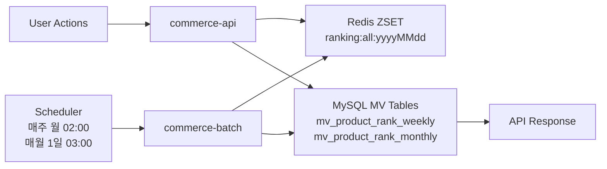
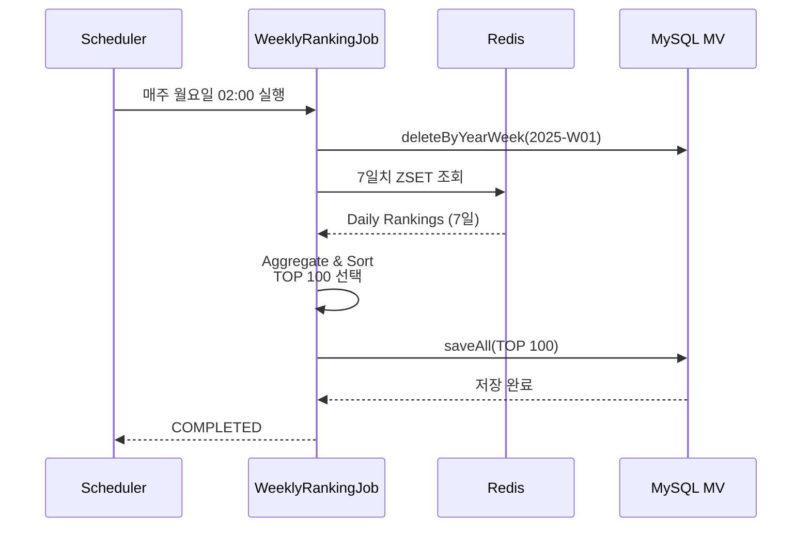

## 📌 Summary

이 PR은 **Spring Batch**와 **Materialized View** 패턴을 사용하여 주간/월간 랭킹 시스템을 구현합니다.

- **Batch Job**: Redis ZSET 데이터를 7일/30일 단위로 집계하여 Materialized View 테이블에 저장
- **Materialized View**: `mv_product_rank_weekly`, `mv_product_rank_monthly` 테이블로 TOP 100 랭킹 사전 계산
- **API 확장**: 기존 일간 랭킹 API에 `period` 파라미터 추가 (daily/weekly/monthly 지원)
- **스케줄링**: 매주 월요일 02:00, 매월 1일 03:00 자동 실행
- **성능 최적화**: 매 요청마다 7~30일치 Redis 집계(O(N))를 MySQL 단순 조회(O(1))로 개선

---

## 💬 Review Points

### 1️⃣ Materialized View vs Real-time Aggregation

**🎯 배경**
- Redis에서 7일치 ZSET을 매 요청마다 집계하면 O(7N) 시간 복잡도
- 주간/월간 랭킹은 데이터 변경이 적고 읽기가 많은 전형적인 Read-heavy 패턴
- 실시간성보다는 정확성과 성능이 중요한 요구사항

**✅ 해결 방법**

Materialized View 패턴을 도입하여 배치 시점에 집계 결과를 MySQL에 사전 저장

**📝 구현 세부사항**

1. **MV 테이블 설계** ([docker/01-schema.sql:380-412](docker/01-schema.sql#L380-L412))

```sql
CREATE TABLE IF NOT EXISTS mv_product_rank_weekly
(
    id            BIGINT AUTO_INCREMENT PRIMARY KEY,
    product_id    BIGINT       NOT NULL,
    year_week     VARCHAR(10)  NOT NULL COMMENT 'ISO 8601 형식: yyyy-Www',
    score         DOUBLE       NOT NULL COMMENT '주간 누적 점수',
    rank_position BIGINT       NOT NULL COMMENT '순위 (1부터 시작)',
    created_at    TIMESTAMP DEFAULT CURRENT_TIMESTAMP,
    updated_at    TIMESTAMP DEFAULT CURRENT_TIMESTAMP ON UPDATE CURRENT_TIMESTAMP,

    INDEX idx_year_week_rank (year_week, rank_position),
    UNIQUE KEY uk_product_year_week (product_id, year_week)
) ENGINE = InnoDB
  DEFAULT CHARSET = utf8mb4
  COMMENT = '주간 상품 랭킹 Materialized View (TOP 100)';
```

2. **Batch Job에서 MV 갱신** ([WeeklyRankingJobConfig.kt:54-79](apps/commerce-batch/src/main/kotlin/com/loopers/batch/ranking/WeeklyRankingJobConfig.kt#L54-L79))

```kotlin
@Bean
@StepScope
fun weeklyRankingReader(
    @Value("#{jobParameters['yearWeek']}") yearWeek: String,
): ItemReader<WeeklyScoreData> {
    log.info("===== 주간 랭킹 배치 시작: $yearWeek =====")

    // 1. 기존 데이터 삭제 (멱등성 보장)
    productRankWeeklyRepository.deleteByYearWeek(yearWeek)
    log.info("기존 주간 랭킹 데이터 삭제: $yearWeek")

    // 2. Redis에서 7일치 데이터 집계 및 TOP 100 선택
    val weeklyScores = aggregateWeeklyScores(yearWeek)
        .sortedByDescending { it.second }
        .take(100)
        .mapIndexed { index, (productId, score) ->
            WeeklyScoreData(productId, score, yearWeek, (index + 1).toLong())
        }

    log.info("주간 집계 완료: ${weeklyScores.size}개 상품")

    // 3. Iterator 기반 ItemReader
    val iterator = weeklyScores.iterator()
    return ItemReader {
        if (iterator.hasNext()) iterator.next() else null
    }
}
```

3. **API에서 MV 조회** ([RankingFacade.kt:118-148](apps/commerce-api/src/main/kotlin/com/loopers/application/ranking/RankingFacade.kt#L118-L148))

```kotlin
fun getWeeklyRankings(yearWeek: String, pageable: Pageable): Page<RankingInfo> {
    val allRankings = productRankWeeklyRepository.findByYearWeekOrderByRankPositionAsc(yearWeek)

    // 페이징 처리
    val start = pageable.offset.toInt()
    val end = minOf(start + pageable.pageSize, allRankings.size)

    if (start >= allRankings.size) {
        return PageImpl(emptyList(), pageable, allRankings.size.toLong())
    }

    val pageContent = allRankings.subList(start, end)

    // 상품 정보 조회
    val productIds = pageContent.map { it.productId }
    val products = productService.getProductsByIds(productIds)
        .associateBy { it.id }

    // 랭킹 정보 생성
    val rankings = pageContent.mapNotNull { mv ->
        products[mv.productId]?.let { product ->
            RankingInfo(
                product = ProductInfo.from(product),
                rank = mv.rankPosition,
                score = mv.score
            )
        }
    }

    return PageImpl(rankings, pageable, allRankings.size.toLong())
}
```

**⚠️ 고려사항**
- MV 데이터는 배치 실행 시점까지의 데이터만 반영 (최대 1주일/1개월 지연 가능)
- 스토리지 오버헤드: 주차별 TOP 100 × 52주 ≈ 5,200개 레코드/년
- 과거 주차 데이터 정리 정책 필요 (예: 1년 이상 된 데이터 아카이빙)
- 배치 실패 시 해당 주차/월 데이터 누락 가능성 → 모니터링 및 재실행 전략 필수

---

### 2️⃣ Chunk-oriented Processing 선택

**🎯 배경**
- Spring Batch는 크게 Tasklet 방식과 Chunk 방식 제공
- Tasklet: 단순한 로직에 적합, 전체 데이터를 한 트랜잭션에서 처리
- Chunk: 대용량 데이터 처리에 유리, Reader/Processor/Writer 분리

**✅ 해결 방법**

Chunk-oriented Processing 선택 (chunk size: 100)

**📝 구현 세부사항**

[WeeklyRankingJobConfig.kt:42-51](apps/commerce-batch/src/main/kotlin/com/loopers/batch/ranking/WeeklyRankingJobConfig.kt#L42-L51)

```kotlin
@Bean
fun weeklyRankingStep(): Step {
    return StepBuilder("weeklyRankingStep", jobRepository)
        .chunk<WeeklyScoreData, ProductRankWeekly>(100, transactionManager)
        .reader(weeklyRankingReader(""))
        .processor(weeklyRankingProcessor())
        .writer(weeklyRankingWriter())
        .listener(stepMonitorListener)
        .build()
}

@Bean
@StepScope
fun weeklyRankingProcessor(): ItemProcessor<WeeklyScoreData, ProductRankWeekly> {
    return ItemProcessor { data ->
        ProductRankWeekly(
            productId = data.productId,
            yearWeek = data.yearWeek,
            score = data.score,
            rankPosition = data.rank,
        )
    }
}

@Bean
fun weeklyRankingWriter(): ItemWriter<ProductRankWeekly> {
    return ItemWriter { items ->
        productRankWeeklyRepository.saveAll(items)
        log.info("주간 랭킹 ${items.size()}개 저장 완료")
    }
}
```

**⚠️ 고려사항**
- 현재는 TOP 100만 저장하므로 1번의 chunk로 처리되지만, 향후 데이터 증가 시 chunk 단위 트랜잭션 효과
- Reader에서 집계 로직이 포함되어 있어 순수한 Read 책임이 아님 → 향후 별도 Tasklet으로 분리 고려
- Processor가 단순 변환만 수행 (비즈니스 로직 없음)

---

### 3️⃣ ISO Week 기준 주차 계산

**🎯 배경**
- "주간 랭킹"의 주차 기준이 모호할 수 있음 (일요일 시작? 월요일 시작?)
- 국제 표준(ISO 8601)은 월요일을 주의 시작으로 정의
- 연도-주차 표현의 일관성 필요

**✅ 해결 방법**

ISO Week 기준 채택 (`yyyy-Www` 형식, 예: `2025-W52`)

**📝 구현 세부사항**

[DateUtils.kt](apps/commerce-batch/src/main/kotlin/com/loopers/support/DateUtils.kt)

```kotlin
object DateUtils {
    private val ISO_WEEK_FORMATTER = DateTimeFormatter.ofPattern("YYYY-'W'ww")
    private val YEAR_MONTH_FORMATTER = DateTimeFormatter.ofPattern("yyyy-MM")
    private val DATE_FORMATTER = DateTimeFormatter.ofPattern("yyyyMMdd")

    /**
     * LocalDate를 ISO 8601 주차 형식으로 변환
     * 예: 2025-01-06 → "2025-W02"
     */
    fun toYearWeek(date: LocalDate): String {
        return date.format(ISO_WEEK_FORMATTER)
    }

    /**
     * ISO 8601 주차 형식에서 해당 주의 7일 날짜 목록 반환
     * 예: "2025-W01" → [2024-12-30, 2024-12-31, 2025-01-01, ..., 2025-01-05]
     */
    fun getWeekDates(yearWeek: String): List<LocalDate> {
        val (year, week) = yearWeek.split("-W").map { it.toInt() }
        val firstDayOfWeek = LocalDate.ofYearDay(year, 1)
            .with(IsoFields.WEEK_OF_WEEK_BASED_YEAR, week.toLong())
            .with(DayOfWeek.MONDAY)

        return (0..6).map { firstDayOfWeek.plusDays(it.toLong()) }
    }

    fun toYearMonth(date: LocalDate): String {
        return date.format(YEAR_MONTH_FORMATTER)
    }

    fun getMonthDates(yearMonth: String): List<LocalDate> {
        val (year, month) = yearMonth.split("-").map { it.toInt() }
        val firstDay = LocalDate.of(year, month, 1)
        val lastDay = firstDay.withDayOfMonth(firstDay.lengthOfMonth())

        return (0 until ChronoUnit.DAYS.between(firstDay, lastDay) + 1)
            .map { firstDay.plusDays(it) }
            .toList()
    }

    fun formatDate(date: LocalDate): String = date.format(DATE_FORMATTER)
}
```

**⚠️ 고려사항**
- ISO Week의 1월 1일이 전년도 마지막 주에 속할 수 있음
  - 예: 2024-12-30은 2025-W01에 속함 (월요일부터 주 시작)
- 연말/연초 주차 계산 시 주의 필요 (경계값 테스트 필수)
- API 문서에 ISO 8601 기준 명시 필요
- 사용자가 이해하기 어려울 수 있음 → UI에서 "12/30(월) ~ 01/05(일)" 형태로 표시 권장

---

### 4️⃣ 배치 스케줄링 전략

**🎯 배경**
- 주간/월간 데이터는 해당 기간이 끝난 직후에 생성되어야 의미가 있음
- 시스템 부하가 적은 시간대 선택 필요
- 배치 실행 간 충돌 방지

**✅ 해결 방법**

Spring `@Scheduled` 사용, 주간은 월요일 새벽 02:00, 월간은 매월 1일 새벽 03:00 실행

**📝 구현 세부사항**

[RankingBatchScheduler.kt](apps/commerce-batch/src/main/kotlin/com/loopers/scheduler/RankingBatchScheduler.kt)

```kotlin
@Component
class RankingBatchScheduler(
    private val jobLauncher: JobLauncher,
    private val weeklyRankingJob: Job,
    private val monthlyRankingJob: Job
) {
    private val log = LoggerFactory.getLogger(javaClass)

    /**
     * 매주 월요일 02:00 실행
     * - 전주(일~토) 데이터 집계
     */
    @Scheduled(cron = "0 0 2 * * MON")
    fun runWeeklyRanking() {
        val previousWeek = DateUtils.toYearWeek(LocalDate.now().minusWeeks(1))
        val params = JobParametersBuilder()
            .addString("yearWeek", previousWeek)
            .addLong("timestamp", System.currentTimeMillis())
            .toJobParameters()

        try {
            val execution = jobLauncher.run(weeklyRankingJob, params)
            log.info("주간 랭킹 배치 완료: $previousWeek, status=${execution.status}")
        } catch (e: Exception) {
            log.error("주간 랭킹 배치 실패: $previousWeek", e)
            // TODO: 알림 시스템 연동 (Slack, Email 등)
        }
    }

    /**
     * 매월 1일 03:00 실행
     * - 전월 데이터 집계
     */
    @Scheduled(cron = "0 0 3 1 * *")
    fun runMonthlyRanking() {
        val previousMonth = DateUtils.toYearMonth(LocalDate.now().minusMonths(1))
        val params = JobParametersBuilder()
            .addString("yearMonth", previousMonth)
            .addLong("timestamp", System.currentTimeMillis())
            .toJobParameters()

        try {
            val execution = jobLauncher.run(monthlyRankingJob, params)
            log.info("월간 랭킹 배치 완료: $previousMonth, status=${execution.status}")
        } catch (e: Exception) {
            log.error("월간 랭킹 배치 실패: $previousMonth", e)
            // TODO: 알림 시스템 연동
        }
    }
}
```

**⚠️ 고려사항**
- 배치 실행 시간이 1시간을 초과할 경우 다음 스케줄과 충돌 가능 (주간 02:00, 월간 03:00로 1시간 간격 확보)
- 배치 실패 시 재실행 전략 필요:
  - 현재는 로깅만 수행
  - 향후 Dead Letter Queue, 재시도 로직, 알림 시스템 추가 필요
- 수동 실행 API 제공: [BatchTestController.kt](apps/commerce-batch/src/main/kotlin/com/loopers/interfaces/batch/BatchTestController.kt)
  - `POST /batch/jobs/weekly?yearWeek=2025-W01`
  - `POST /batch/jobs/monthly?yearMonth=2025-01`

---

### 5️⃣ 멱등성(Idempotency) 보장

**🎯 배경**
- 배치 Job이 실패 후 재실행되거나 중복 실행될 수 있음
- 동일한 주차/월에 대해 여러 번 실행되어도 결과가 동일해야 함
- 데이터 정합성 유지 필수

**✅ 해결 방법**

실행 시작 시 해당 기간의 기존 데이터를 삭제하고 재계산

**📝 구현 세부사항**

1. **Repository 삭제 메서드** ([ProductRankWeeklyRepository.kt](apps/commerce-batch/src/main/kotlin/com/loopers/infrastructure/ProductRankWeeklyRepository.kt))

```kotlin
interface ProductRankWeeklyRepository : JpaRepository<ProductRankWeekly, Long> {
    fun findByYearWeekOrderByRankPositionAsc(yearWeek: String): List<ProductRankWeekly>

    @Modifying
    @Transactional
    fun deleteByYearWeek(yearWeek: String)
}
```

2. **Reader에서 삭제 후 집계** ([WeeklyRankingJobConfig.kt:60-62](apps/commerce-batch/src/main/kotlin/com/loopers/batch/ranking/WeeklyRankingJobConfig.kt#L60-L62))

```kotlin
// 1. 기존 데이터 삭제 (멱등성 보장)
productRankWeeklyRepository.deleteByYearWeek(yearWeek)
log.info("기존 주간 랭킹 데이터 삭제: $yearWeek")

// 2. Redis에서 7일치 데이터 집계 및 TOP 100 선택
val weeklyScores = aggregateWeeklyScores(yearWeek)
    .sortedByDescending { it.second }
    .take(100)
```

3. **테스트로 멱등성 검증** ([WeeklyRankingJobConfigTest.kt:78-94](apps/commerce-batch/src/test/kotlin/com/loopers/batch/ranking/WeeklyRankingJobConfigTest.kt#L78-L94))

```kotlin
@DisplayName("동일 주차에 대해 배치를 2번 실행해도 결과가 같다 (멱등성)")
@Test
fun idempotency() {
    // Given
    val yearWeek = "2025-W01"
    prepareRedisData(yearWeek)

    // When: 첫 번째 실행
    runBatch(yearWeek)
    val firstResult = productRankWeeklyRepository.findByYearWeekOrderByRankPositionAsc(yearWeek)

    // When: 두 번째 실행
    runBatch(yearWeek)
    val secondResult = productRankWeeklyRepository.findByYearWeekOrderByRankPositionAsc(yearWeek)

    // Then: 결과가 동일
    assertThat(firstResult).hasSize(100)
    assertThat(secondResult).hasSize(100)
    assertThat(firstResult.map { it.productId }).isEqualTo(secondResult.map { it.productId })
    assertThat(firstResult.map { it.score }).isEqualTo(secondResult.map { it.score })
}
```

**⚠️ 고려사항**
- 삭제와 삽입 사이의 짧은 시간 동안 해당 주차 데이터가 비어있을 수 있음
  - API 조회 시 빈 결과 반환 가능
  - 해결 방안: 임시 테이블에 저장 후 RENAME TABLE 또는 버전 필드 사용
- `@Transactional` 범위 내에서 삭제/삽입이 수행되므로 All-or-Nothing 보장
- 단, Reader에서 삭제가 수행되므로 Step 실패 시 롤백되지 않음 (현재 구조의 한계)

---

### 6️⃣ Strategy Pattern으로 기간별 로직 분리

**🎯 배경**
- 일간/주간/월간 랭킹 조회 로직이 데이터 소스만 다를 뿐 구조가 유사
- Controller에서 if-else 분기 대신 전략 패턴으로 깔끔하게 처리

**✅ 해결 방법**

`RankingPeriod` enum에 전략 패턴 적용

**📝 구현 세부사항**

[RankingPeriod.kt](apps/commerce-api/src/main/kotlin/com/loopers/application/ranking/RankingPeriod.kt)

```kotlin
enum class RankingPeriod {
    DAILY {
        override fun formatDate(date: String?): String =
            date ?: LocalDate.now().format(DateTimeFormatter.BASIC_ISO_DATE)

        override fun getRankings(
            date: String?,
            pageable: Pageable,
            facade: RankingFacade
        ): Page<RankingInfo> =
            facade.getRankings(formatDate(date), pageable)  // Redis 조회
    },
    WEEKLY {
        override fun formatDate(date: String?): String =
            date ?: DateUtils.toYearWeek(LocalDate.now())

        override fun getRankings(
            date: String?,
            pageable: Pageable,
            facade: RankingFacade
        ): Page<RankingInfo> =
            facade.getWeeklyRankings(formatDate(date), pageable)  // MV 조회
    },
    MONTHLY {
        override fun formatDate(date: String?): String =
            date ?: DateUtils.toYearMonth(LocalDate.now())

        override fun getRankings(
            date: String?,
            pageable: Pageable,
            facade: RankingFacade
        ): Page<RankingInfo> =
            facade.getMonthlyRankings(formatDate(date), pageable)  // MV 조회
    };

    abstract fun formatDate(date: String?): String
    abstract fun getRankings(
        date: String?,
        pageable: Pageable,
        facade: RankingFacade
    ): Page<RankingInfo>

    companion object {
        fun from(period: String): RankingPeriod = try {
            valueOf(period.uppercase())
        } catch (e: IllegalArgumentException) {
            DAILY  // 기본값
        }
    }
}
```

[RankingV1Controller.kt:30-38](apps/commerce-api/src/main/kotlin/com/loopers/interfaces/api/ranking/RankingV1Controller.kt#L30-L38)

```kotlin
@GetMapping
override fun getRankings(
    @RequestParam(required = false, defaultValue = "daily") period: String,
    @RequestParam(required = false) date: String?,
    pageable: Pageable
): ApiResponse<Page<RankingInfo>> {
    val rankingPeriod = RankingPeriod.from(period)
    val rankings = rankingPeriod.getRankings(date, pageable, rankingFacade)
    return ApiResponse.success(rankings)
}
```

**⚠️ 고려사항**
- enum에 비즈니스 로직이 포함되어 복잡도가 증가할 수 있음
- 향후 기간 타입이 많아지면 별도 Strategy 인터페이스 + 구현 클래스로 분리 고려
- 현재는 3가지 타입만 있어 enum으로 충분히 관리 가능

---

## ✅ Checklist

### Database & Schema
- [x] MV 테이블 스키마 작성 (`mv_product_rank_weekly`, `mv_product_rank_monthly`)
- [x] 복합 인덱스 설계 (`idx_year_week_rank`, `uk_product_year_week`)
- [x] `docker/01-schema.sql`에 DDL 추가

### Batch Module Setup
- [x] `commerce-batch` 모듈 생성 및 `settings.gradle.kts` 등록
- [x] Spring Batch 의존성 추가 (`spring-boot-starter-batch`, `spring-boot-starter-web`)
- [x] `@EnableBatchProcessing`, `@EnableScheduling` 설정
- [x] `application.yml` 배치 설정 (프로파일별 `initialize-schema` 설정)

### Entity & Repository
- [x] `ProductRankWeekly` 엔티티 작성
- [x] `ProductRankMonthly` 엔티티 작성
- [x] Repository 인터페이스 작성 (custom delete, find 메서드)
- [x] commerce-api, commerce-batch 양쪽에서 사용 가능하도록 모듈 구조 설정

### Batch Job Implementation
- [x] `DateUtils` 유틸리티 작성 (ISO Week, 날짜 계산)
- [x] `WeeklyRankingJobConfig` 작성 (Job, Step, Reader/Processor/Writer)
- [x] `MonthlyRankingJobConfig` 작성
- [x] Redis 집계 로직 구현 (7일/30일 합산)
- [x] TOP 100 필터링 및 MV 저장 로직
- [x] 멱등성 보장 (기존 데이터 삭제 후 재생성)
- [x] JobListener, StepMonitorListener 추가 (배치 모니터링)

### Scheduler
- [x] `RankingBatchScheduler` 작성
- [x] Cron 표현식 설정 (주간: 월요일 02:00, 월간: 1일 03:00)
- [x] JobParameters 설정 (yearWeek, yearMonth, timestamp)
- [x] 예외 처리 및 로깅

### API Extension (commerce-api)
- [x] `RankingPeriod` enum 추가 (DAILY, WEEKLY, MONTHLY) - Strategy Pattern
- [x] `RankingFacade`에 `getWeeklyRankings()`, `getMonthlyRankings()` 추가
- [x] MV Repository 주입 및 페이징 로직 구현
- [x] Controller에 `period` 파라미터 추가
- [x] API 응답 형식 통일 (`ApiResponse<Page<RankingInfo>>`)
- [x] Swagger API 문서 업데이트

### Testing
- [x] `WeeklyRankingJobConfigTest` 통합 테스트 (Batch 실행, MV 저장 확인)
- [x] `MonthlyRankingJobConfigTest` 통합 테스트
- [x] `RankingFacadeIntegrationTest` 통합 테스트 (실제 DB, 페이징)
- [x] 멱등성 테스트 (동일 주차 재실행)
- [x] Testcontainers 기반 테스트 환경 구축 (MySQL 8.0)
- [x] Spring Batch 메타데이터 테이블 초기화 (`init-batch-tables.sql`)

### Documentation
- [x] README 업데이트 (commerce-batch 모듈 설명, 포트 정보)
- [x] 테스트 데이터 초기화 스크립트 작성 (`init-ranking-data.sh`, `init-ranking-simple.redis`)
- [x] BatchTestController API 제공 (수동 배치 실행)

---

## 📊 Testing Strategy

### Integration Tests
- **WeeklyRankingJobConfigTest**, **MonthlyRankingJobConfigTest**
  - Redis 테스트 데이터 준비 (7일/30일치)
  - Batch Job 실행
  - MV 테이블 검증 (TOP 100, 순위 정확도)
  - 멱등성 테스트 (동일 파라미터 재실행 시 결과 동일)

- **RankingFacadeIntegrationTest**
  - MV 테이블 사전 데이터 저장
  - 페이징 조회 검증 (1페이지, 2페이지)
  - 상품 정보 Aggregation 확인

### Test Coverage
- Batch Job 핵심 로직: 통합 테스트로 커버
- API Layer: 통합 테스트로 실제 DB 조회 검증
- Testcontainers로 실제 MySQL 환경 재현

---

## 🔗 References

- Round 10 Quest: `.codeguide/round10/provided/round-10-quests.md`
- Spring Batch 공식 문서: https://docs.spring.io/spring-batch/reference/
- ISO 8601 Week Date: https://en.wikipedia.org/wiki/ISO_week_date

---

## 📸 System Architecture

### Overall Flow



### Batch Job Flow



### API Request/Response Example

**Request**
```bash
GET /api/v1/rankings?period=weekly&date=2025-W01&size=10&page=0
```

**Response**
```json
{
  "success": true,
  "data": {
    "content": [
      {
        "rank": 1,
        "product": {
          "id": 101,
          "name": "인기 상품",
          "price": 29900,
          "brandName": "브랜드A"
        },
        "score": 1523.45
      }
    ],
    "totalElements": 100,
    "totalPages": 10,
    "size": 10,
    "number": 0
  }
}
```
