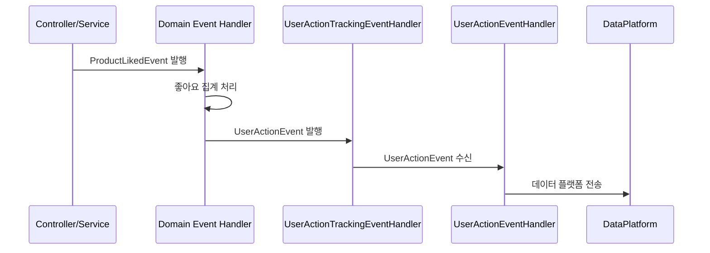

# UserActionEvent 전체 적용 가이드

## 📌 핵심 아이디어

**도메인 이벤트 핸들러에서 UserActionEvent를 발행**하여 관심사를 분리합니다.

```
Service Layer (도메인 로직)
    ↓ 도메인 이벤트 발행 (ProductLikedEvent, OrderCreatedEvent 등)
Event Handler (인프라 관심사)
    ↓ UserActionEvent 발행 (사용자 행동 추적)
UserActionEventHandler (데이터 플랫폼 전송)
```

---

## 🎯 적용 대상

### 1. 좋아요/좋아요 취소 (LIKE/UNLIKE) ✅ 이미 적용됨

**도메인 이벤트:** `ProductLikedEvent`, `ProductUnlikedEvent`

**수정 위치:** `ProductLikeEventHandler.kt`

```kotlin
@Component
class ProductLikeEventHandler(
    @Qualifier("eventCoroutineScope")
    private val coroutineScope: CoroutineScope,
    private val productLikeEventProcessor: ProductLikeEventProcessor,
    private val eventPublisher: ApplicationEventPublisher, // 추가
) {
    private val logger = LoggerFactory.getLogger(javaClass)

    @TransactionalEventListener(phase = TransactionPhase.AFTER_COMMIT)
    fun handleProductLiked(event: ProductLikedEvent) {
        coroutineScope.launch {
            try {
                productLikeEventProcessor.processProductLiked(event.productId)

                // UserActionEvent 발행 추가
                eventPublisher.publishEvent(
                    UserActionEvent(
                        userId = event.memberId.toString(),
                        actionType = ActionType.LIKE,
                        targetEntityType = EntityType.PRODUCT,
                        targetEntityId = event.productId,
                        metadata = mapOf("likeId" to event.likeId.toString()),
                        occurredAt = event.likedAt
                    )
                )
            } catch (e: Exception) {
                logger.error("좋아요 집계 실패: productId=${event.productId}", e)
            }
        }
    }

    @TransactionalEventListener(phase = TransactionPhase.AFTER_COMMIT)
    fun handleProductUnliked(event: ProductUnlikedEvent) {
        coroutineScope.launch {
            try {
                productLikeEventProcessor.processProductUnliked(event.productId)

                // UserActionEvent 발행 추가 (UNLIKE 추적)
                // Note: ProductUnlikedEvent에는 likeId가 없음 (삭제 후 발행되기 때문)
                eventPublisher.publishEvent(
                    UserActionEvent(
                        userId = event.memberId.toString(),
                        actionType = ActionType.UNLIKE,
                        targetEntityType = EntityType.PRODUCT,
                        targetEntityId = event.productId,
                        metadata = emptyMap(), // likeId 없음
                        occurredAt = event.unlikedAt
                    )
                )
            } catch (e: Exception) {
                logger.error("좋아요 취소 집계 실패: productId=${event.productId}", e)
            }
        }
    }
}
```

**LikeService 수정:** UserActionEvent 발행 제거

현재 `LikeService`는 이미 올바르게 구현되어 있습니다:
- `addLike()`: `ProductLikedEvent`만 발행 (UserActionEvent 없음) ✅
- `cancelLike()`: `ProductUnlikedEvent`만 발행 (UserActionEvent 없음) ✅

```kotlin
@Transactional
fun addLike(memberId: String, productId: Long): Like {
    val member = memberRepository.findByMemberIdOrThrow(memberId)

    // 기존 좋아요 확인 (멱등성)
    val existingLike = likeRepository.findByMemberIdAndProductId(member.id, productId)
    if (existingLike != null) {
        return existingLike
    }

    // 좋아요 저장
    val product = productRepository.findByIdOrThrow(productId)
    val like = Like.of(member, product)
    val savedLike = likeRepository.save(like)

    // ProductLikedEvent만 발행 (UserActionEvent 제거됨) ✅
    eventPublisher.publishEvent(
        ProductLikedEvent(
            likeId = savedLike.id,
            memberId = member.id,
            productId = productId,
            likedAt = Instant.now()
        )
    )

    return savedLike
}

@Transactional
fun cancelLike(memberId: String, productId: Long) {
    val member = memberRepository.findByMemberIdOrThrow(memberId)

    // 좋아요 확인 (멱등성)
    val like = likeRepository.findByMemberIdAndProductId(member.id, productId)
        ?: return

    // 좋아요 삭제
    likeRepository.deleteByMemberIdAndProductId(member.id, productId)

    // ProductUnlikedEvent만 발행 (UserActionEvent 제거됨) ✅
    eventPublisher.publishEvent(
        ProductUnlikedEvent(
            productId = productId,
            memberId = member.id,
            unlikedAt = Instant.now()
        )
    )
}
```

**핵심 포인트:**
- ✅ `LikeService`는 도메인 이벤트(`ProductLikedEvent`, `ProductUnlikedEvent`)만 발행
- ✅ 사용자 행동 추적(`UserActionEvent`)은 `ProductLikeEventHandler`에서 발행
- ✅ 관심사 분리: 도메인 로직 vs 인프라/분석 관심사

---

### 2. 주문 (ORDER) - 신규 적용

**도메인 이벤트:** `OrderCreatedEvent`

**새 핸들러 생성:** `apps/commerce-api/src/main/kotlin/com/loopers/infrastructure/event/UserActionTrackingEventHandler.kt`

```kotlin
package com.loopers.infrastructure.event

import com.loopers.domain.order.event.OrderCreatedEvent
import com.loopers.support.event.ActionType
import com.loopers.support.event.EntityType
import com.loopers.support.event.UserActionEvent
import org.springframework.context.ApplicationEventPublisher
import org.springframework.stereotype.Component
import org.springframework.transaction.event.TransactionPhase
import org.springframework.transaction.event.TransactionalEventListener

@Component
class UserActionTrackingEventHandler(
    private val eventPublisher: ApplicationEventPublisher,
) {

    /**
     * 주문 생성 시 UserActionEvent 발행
     */
    @TransactionalEventListener(phase = TransactionPhase.AFTER_COMMIT)
    fun handleOrderCreated(event: OrderCreatedEvent) {
        eventPublisher.publishEvent(
            UserActionEvent(
                userId = event.memberId,
                actionType = ActionType.ORDER,
                targetEntityType = EntityType.ORDER,
                targetEntityId = event.orderId,
                metadata = mapOf(
                    "orderAmount" to event.orderAmount.toString(),
                    "couponId" to (event.couponId?.toString() ?: "")
                ),
                occurredAt = event.createdAt
            )
        )
    }
}
```

---

### 3. 상품 상세 조회 (VIEW) ✅ 완료

**도메인 이벤트:** `ProductViewedEvent` ✅ 이미 생성됨

현재 상태:
- ✅ `ProductViewedEvent.kt` 생성됨
- ✅ `UserActionTrackingEventHandler.handleProductViewed()` 구현됨
- ✅ `ProductV1Controller.getProduct()`에서 이벤트 발행 추가됨

**ProductV1Controller** (✅ 이미 구현됨):

```kotlin
@GetMapping("/{productId}")
override fun getProduct(
    @RequestHeader(value = "X-USER-ID", required = false) memberId: String?,
    @PathVariable productId: Long,
): ApiResponse<ProductV1Dto.ProductResponse> {

    // 상품 조회 이벤트 발행 (비회원도 발행)
    eventPublisher.publishEvent(
        ProductViewedEvent(
            productId = productId,
            memberId = memberId,
            viewedAt = Instant.now()
        )
    )

    return productFacade.getProduct(productId)
        .let { ProductV1Dto.ProductResponse.from(it) }
        .let { ApiResponse.success(it) }
}
```

**UserActionTrackingEventHandler** (✅ 이미 구현됨):

```kotlin
@TransactionalEventListener(phase = TransactionPhase.AFTER_COMMIT)
fun handleProductViewed(event: ProductViewedEvent) {
    // 비로그인 사용자는 추적하지 않음
    if (event.memberId == null) return

    eventPublisher.publishEvent(
        UserActionEvent(
            userId = event.memberId,
            actionType = ActionType.VIEW,
            targetEntityType = EntityType.PRODUCT,
            targetEntityId = event.productId,
            metadata = emptyMap(),
            occurredAt = event.viewedAt
        )
    )
}
```

---

### 4. 상품 목록 조회 (BROWSE) ✅ 완료

**도메인 이벤트:** `ProductBrowsedEvent` ✅ 생성 완료

**새 도메인 이벤트 생성:** `apps/commerce-api/src/main/kotlin/com/loopers/domain/product/event/ProductBrowsedEvent.kt`

```kotlin
package com.loopers.domain.product.event

import com.loopers.domain.product.ProductSortType
import java.time.Instant

data class ProductBrowsedEvent(
    val memberId: String?,
    val brandId: Long?,
    val sortType: ProductSortType,
    val page: Int,
    val browsedAt: Instant
)
```

**ActionType 확장:**

```kotlin
enum class ActionType {
    VIEW,      // 상품 상세 조회
    BROWSE,    // 상품 목록 조회 (신규 추가)
    CLICK,
    LIKE,
    UNLIKE,
    ORDER,
    SEARCH
}
```

**ProductV1Controller 수정:**

```kotlin
@GetMapping
override fun getProducts(
    @RequestParam(required = false) brandId: Long?,
    @RequestParam(required = false, defaultValue = "LATEST") sort: ProductSortType,
    @RequestParam(defaultValue = "0") page: Int,
    @RequestParam(defaultValue = "20") size: Int,
    @RequestHeader(value = "X-USER-ID", required = false) memberId: String?
): ApiResponse<Page<ProductV1Dto.ProductResponse>> {
    val pageable = PageRequest.of(page, size)

    // 목록 조회 이벤트 발행
    eventPublisher.publishEvent(
        ProductBrowsedEvent(
            memberId = memberId,
            brandId = brandId,
            sortType = sort,
            page = page,
            browsedAt = Instant.now()
        )
    )

    return productFacade.getProducts(brandId, sort, pageable)
        .map { ProductV1Dto.ProductResponse.from(it) }
        .let { ApiResponse.success(it) }
}
```

**UserActionTrackingEventHandler에 추가:**

```kotlin
@TransactionalEventListener(phase = TransactionPhase.AFTER_COMMIT)
fun handleProductBrowsed(event: ProductBrowsedEvent) {
    // 비로그인 사용자는 추적하지 않음
    if (event.memberId == null) return

    eventPublisher.publishEvent(
        UserActionEvent(
            userId = event.memberId,
            actionType = ActionType.BROWSE,
            targetEntityType = EntityType.PRODUCT,
            targetEntityId = 0L, // 목록 조회는 특정 상품 없음
            metadata = mapOf(
                "brandId" to (event.brandId?.toString() ?: "all"),
                "sortType" to event.sortType.name,
                "page" to event.page.toString()
            ),
            occurredAt = event.browsedAt
        )
    )
}
```

---

## 📁 파일 구조

```
apps/commerce-api/src/main/kotlin/com/loopers/
├── domain/
│   ├── like/
│   │   └── event/
│   │       ├── ProductLikeEventHandler.kt (수정)
│   │       ├── ProductLikedEvent.kt (기존)
│   │       └── ProductUnlikedEvent.kt (기존)
│   ├── order/
│   │   └── event/
│   │       └── OrderCreatedEvent.kt (기존)
│   └── product/
│       └── event/
│           ├── ProductViewedEvent.kt (신규) ✅
│           ├── ProductBrowsedEvent.kt (신규) ✅
│           └── ProductSearchedEvent.kt (신규, 미사용)
├── infrastructure/
│   └── event/
│       ├── UserActionTrackingEventHandler.kt (신규) ⭐
│       └── UserActionEventHandler.kt (기존)
└── support/
    └── event/
        └── UserActionEvent.kt (기존)
```

---

## 🔄 이벤트 흐름도



---

## ✅ 적용 체크리스트

### Phase 1: 기존 코드 정리
- [x] `ActionType`에 `UNLIKE` 추가
- [x] `ProductLikeEventHandler`에 `ApplicationEventPublisher` 주입
- [x] `ProductLikeEventHandler.handleProductLiked`에서 `UserActionEvent` 발행 추가
- [x] `ProductLikeEventHandler.handleProductUnliked`에서 `UserActionEvent` 발행 추가 (likeId 없이)
- [x] `LikeService`는 이미 올바르게 구현됨 (도메인 이벤트만 발행)

### Phase 2: 주문 추적 추가
- [x] `UserActionTrackingEventHandler.kt` 생성됨
- [x] `handleOrderCreated` 메서드 구현됨

### Phase 3: 상품 상세 조회 추적 (선택)
- [x] `ProductViewedEvent.kt` 생성됨
- [x] `UserActionTrackingEventHandler.handleProductViewed` 추가됨
- [x] `ProductV1Controller.getProduct()`에 `eventPublisher` 주입 및 이벤트 발행 추가
- [x] `ProductV1Controller.getProduct()`에 `@RequestHeader memberId` 파라미터 추가 (nullable)

### Phase 4: 상품 목록 조회 추적 (선택)
- [x] `ActionType`에 `BROWSE` 추가
- [x] `ProductBrowsedEvent.kt` 생성
- [x] `ProductV1Controller.getProducts()`에 `@RequestHeader memberId` 파라미터 추가 (nullable)
- [x] `ProductV1Controller.getProducts()`에서 `ProductBrowsedEvent` 발행
- [x] `UserActionTrackingEventHandler.handleProductBrowsed` 추가

---

## 🤔 설계 결정사항

### 1. 왜 이벤트 핸들러에서 UserActionEvent를 발행하나?

**관심사 분리:**
- **도메인 계층 (Service)**: 비즈니스 로직에만 집중
- **인프라 계층 (EventHandler)**: 사용자 행동 추적 같은 부가 기능

**확장 용이:**
- 새로운 도메인 이벤트가 추가되면 핸들러만 추가
- 서비스 레이어는 수정 불필요

### 2. 비로그인 사용자는 어떻게 처리하나?

**옵션 1: 추적하지 않음 (추천)**
```kotlin
if (event.memberId == null) return
```

**옵션 2: 익명 ID로 추적**
```kotlin
userId = event.memberId ?: "anonymous-${UUID.randomUUID()}"
```

### 3. CLICK 이벤트는 어떻게 처리하나?

**프론트엔드에서 발생:**
- 클릭은 주로 프론트엔드에서 발생
- 별도 API 엔드포인트 필요: `POST /api/user-actions/click`

**또는:**
- 상품 조회 시 자동으로 VIEW로 간주
- 실제 클릭 추적은 프론트엔드 분석 도구 사용 (GA, Mixpanel 등)

---

## 🚀 우선순위

1. **필수**: 좋아요, 주문 추적 ✅ 완료
2. **권장**: 상품 상세 조회 추적 ✅ 완료
3. **선택**: 상품 목록 조회 추적 (BROWSE) ✅ 완료

---

## 📝 참고사항

### ActionType 확장

현재 (✅ UNLIKE 추가됨):
```kotlin
enum class ActionType {
    VIEW,      // 상품 상세 조회
    CLICK,
    LIKE,
    UNLIKE,    // ✅ 좋아요 취소 추가됨
    ORDER,
    SEARCH
}
```

목록 조회 추가 시:
```kotlin
enum class ActionType {
    VIEW,      // 상품 상세 조회
    BROWSE,    // 상품 목록 조회 (추가 필요)
    CLICK,
    LIKE,
    UNLIKE,    // ✅ 이미 추가됨
    ORDER,
    SEARCH
}
```

추후 추가 고려:
```kotlin
enum class ActionType {
    VIEW,
    BROWSE,
    CLICK,
    LIKE,
    UNLIKE,
    ORDER,
    ORDER_CANCEL,      // 주문 취소
    SEARCH,
    ADD_TO_CART,       // 장바구니 추가
    PAYMENT_COMPLETE,  // 결제 완료
}
```

### EntityType 확장

현재:
```kotlin
enum class EntityType {
    PRODUCT,
    ORDER,
    BRAND
}
```

추가 고려:
```kotlin
enum class EntityType {
    PRODUCT,
    ORDER,
    BRAND,
    CART,
    COUPON,
    REVIEW,
}
```
